# JavaScript基础第一天

## JavaScript介绍

### JavaScript是什么

[Javascript权威网站：]()[MDN Web Docs](https://developer.mozilla.org/zh-CN/)

#### 定义

是一种运行在客户端（浏览器）的<mark>编程语言</mark>，<u>（注意：HTML和CSS不是编程语言，它们是一个标记语言），</u>实现人机交互效果

#### 作用

1. 网页特效 (监听用户的一些行为让网页作出对应的反馈)

2. 表单验证 (针对表单数据的合法性进行判断)

3. 数据交互 (获取后台的数据, 渲染到前端)

4. 服务端编程 (node.js)

#### 组成

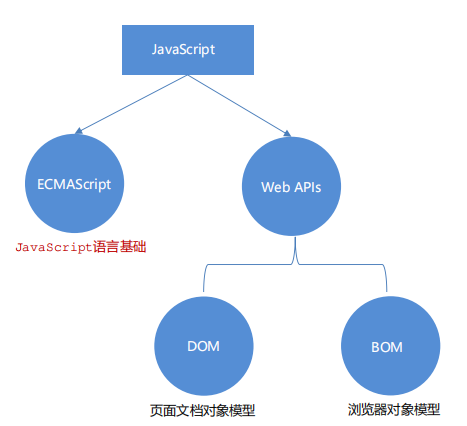

##### ECMAScript

规定了js基础语法核心知识。

eg：变量、分支语句、循环语句、对象等等

##### Web APIs

1. DOM 操作文档，eg：页面元素进行移动、大小、添加删除等操作

2. BOM 操作浏览器，eg：页面弹窗，检测窗口宽度，存储数据到浏览器等等

### JavaScript书写位置

<mark>规范：</mark>script标签写在`</body>`上面

1. 内部JavaScript
   直接写在HTML标签内部，用Script标签包裹

   ```html
   <script>
     // 页面弹出警示框
     alert("你好，js~");
   </script>
   ```

2. 外部JavaScript
   新建js文件夹，然后再js文件夹中新建xxx.js文件即可

   ```js
   alert("我是外部的 js文件");
   ```

   ```html
   <body>
     <script src="./js/my.js">
       // 中间不要写内容
     </script>
   </body>
   ```

3. 内联JavaScript
   代码写在标签内部

   ```html
   <body>
       <button onclick="alert('逗你玩~')">
   </body>
   ```

### JavaScript的注释

单行注释：使用`ctrl + /`

多行注释：使用 `shift + alt + a`

### JavaScript的结束符

可加可不加，应团队要求

### 输入和输出语法

什么是语法：人和计算机打交道的规则约定

#### 输出语法

语法1：向body内输出内容，若输出的内容写的是标签，也会被解析成网页元素

```js
document.write("我是div标签");
document.write("<h1>我是标题</h1>");
```

语法2：页面弹出警告提示框

```js
alert("要输出的内容");
```

语法3：控制台输出语法，程序员调试使用

```js
console.log("控制台打印");
```

#### 输入语法

语法：显示一个对话框，对话框中包含一条文字信息，用来提示用户输入文字

```js
prompt("请输入您的年龄：");
```

### 字面量

在计算机科学中，字面量（literal）是在计算机中描述 事/物

- 1000：数字字面量

- ’黑马程序员‘ ：字符串字面量

- [ ]：数组字面量

- {}：对象字面量

## 变量

### 变量是什么

变量就是一个装东西的盒子，计算机中存储数据的<mark>“容器”</mark>，它可以让计算机变得有记忆，用来存放数据

### 变量基本使用

#### 变量的声明

语法：声明关键字，变量名

```js
let age;
```

#### 变量的赋值

```js
let age;
age = 18;
console.log(age);
```

### 变量的本质

内存：计算机中存储数据的地方，相当于一个空间

变量本质：是程序在内存中申请的一块用来存放数据的小空间

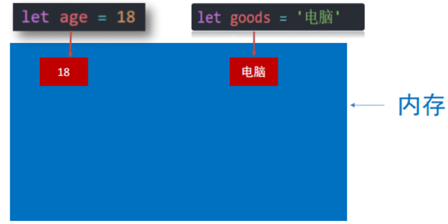

### 变量命名规则与规范

关于变量的名称（标识符）有一系列的规则需要遵守：

1. 只能是字母、数字、下划线、$，且不能以数字开头
2. 字母区分大小写，如 Age 和 age 是不同的变量
3. JavaScript 内部已占用于单词（关键字或保留字）不允许使用
4. 尽量保证变量具有一定的语义，见字知义

注：所谓关键字是指 JavaScript 内部使用的词语，如 `let` 和`var`，保留字是指 JavaScript 内部目前没有使用的词语，但是将来可能会使用词语。

var的缺陷：

- 可以先使用 在声明 (不合理)

- var 声明过的变量可以重复声明(不合理)

- 比如变量提升、全局变量、没有块级作用域等等

#### 数组

一种将一组数据存储在单个变量名下的优雅方式

```js
let arr = [];
```

##### 1.声明语法

```js
let names = ["小明", "小刚", "小红", "小丽", "小米"];
```

##### 2.取值语法

```js
let arr = ["刘德华", "张学友", "黎明", "郭富城", "pink老师"];
console.log(arr);
document.write(arr);
console.log(arr[0]);
console.log(arr[4]);
```

## 常量

### 概念

使用`const`声明的变量称为“常量”

### 使用场景

当某个变量永远<mark>不会改变</mark>时，就可以使用const来声明，而不是let

### 命名规范

和变量一致

### 常量使用

```js
const G = 9.8;
console.log(G);
```

### 注意

常量<mark>不允许</mark>重新赋值，声明的时候必须赋值（初始化）

### 小技巧

不需要重新赋值的数据使用const

## 数据类型

### 基本数据类型（7种）：

#### 1.number 数字型

即我们数学中学习到的数字，可以是整数、小数、正数、负数。

`JS`是<mark>弱数据类型</mark>，变量到底属于那种类型，只有赋值之后，我们才能确定

`Java`是<mark>强数据类型</mark>，例如`int a = 3` 必须是整数

```js
<script>
    //js 弱数据类型的语言 只有当我们赋值了，才知道是什么数据类型
    let num = 'pink'
    let num = 10.11
    console.log(num)
`</script>`
```

数字可以有很多操作，比如，乘法 \* 、除法 / 、加法 + 、减法 - 等等，所以经常和算术运算符一起。

数学运算符也叫算术运算符，主要包括加、减、乘、除、取余（求模）。

```js
console.log(1 + 1);
console.log(1 * 1);
console.log(1 / 1);
console.log(4 % 2); // 求余数
console.log(5 % 3); // 求余数  2
console.log(3 % 5); // 求余数  3
```

`NaN:not a number ` 代表一个计算错误。它是一个不正确的或者一个未定义的数学操作所得到的结果

```js
console.log("pink老师" - 2);
```

NaN 是粘性的。任何对 NaN 的操作都会返回 NaN

```js
console.log(NaN - 2);
console.log(NaN + 2);
console.log(NaN / 2);
console.log(NaN === NaN);
```

#### 2.string 字符串型

通过单引号（ ''） 、双引号（ ""）或反引号( ` ) 包裹的数据都叫字符串，<mark>单引号和双引号没有本质上的区别</mark>，推

荐使用单引号。字符串用`console.log()`打印出来是<mark>黑色</mark>，数字打印出来是<mark>蓝色</mark>

注意事项：

1. 无论单引号或是双引号必须成对使用

2. 单引号/双引号可以互相嵌套，但是不以自已嵌套自已（口诀：外双内单，或者外单内双）

3. 必要时可以使用<mark>转义符 \</mark>，输出单引号或双引号

```js
console.log('pink老师讲课非常有"基情"');
console.log("pink老师讲课非常有'基情'");
console.log("pink老师讲课非常有'基情'");
```

字符串拼接：

数字相加，字符相连

```js
document.write("我今年" + 19);
document.write("我今年" + age);
document.write("我今年" + age + "岁了");
```

##### 模板字符串

语法

- `` (反引号)

- 在英文输入模式下按键盘的tab键上方那个键（1左边那个键）

- 内容拼接变量时，用 ${ } 包住变量

```js
let age1 = 23;
document.write(`我今年${age1}岁了`);
```

#### 3.boolean 布尔型

有两个固定的值 `true` 和` false`，表示肯定的数据用<mark> true（真）</mark>，表示否定的数据用<mark> false（假）</mark>。

```js
console.log(3 > 4);
let isCool = false;
console.log(isCool);
```

#### 4.undefined 未定义型

只声明变量，不赋值的情况下，变量的默认值为 `undefined`，因为`JavaScript`是弱数据类型。

```js
let num;
console.log(num);
```

#### 5.null 空类型

`JavaScript` 中的 `null` 仅仅是一个代表“无”、“空”或“值未知”的特殊值

```js
let obj = null;
console.log(obj);
```

**`null` 和 `undefined` 区别：**

- `undefined` 表示没有赋值

- `null` 表示赋值了，但是内容为空

```js
console.log(undefined + 1);
console.log(null + 1);
```

#### 6.Symbol（独一无二的标记）---ES6引入

#### 7.BigInt (任意精度的整数) --- ES2020 引入

`BigInt` 解决的是 JS 在处理“超级大数”时的**精度丢失**问题。

JS 的普通数字类型（Number）是基于 IEEE 754 标准的 **64位浮点数**。它能安全表示的最大整数是 $2^{53} - 1$（即 `Number.MAX_SAFE_INTEGER`）。超过这个数，计算就会出错：

```js
console.log(2 ** 53 === 2 ** 53 + 1); // true! 精度崩了
```

- **创建方式：** 在数字后面加个 `n`，或者使用 `BigInt()` 构造函数。

  ```js
  const huge = 9007199254740991n;
  const alsoHuge = BigInt("9007199254740991");
  console.log(huge + 1n); // 9007199254740992n (准确无误)
  ```

- **限制：**
  - 不能和普通 `Number` 直接混合运算（必须手动转换类型）。
  - 不支持小数（除法会向下取整）。
  - 没有 `+0` 和 `-0` 的区别。

#### 8.检测数据类型

通过`typeof`关键字检测数据类型

```js
let num = 10;
console.log(typeof num);

let str = "pink";
console.log(typeof str);

let str1 = "10";
console.log(typeof str1);

let flag = false;
console.log(typeof flag);

let un;
console.log(typeof un);

let obj = null;
console.log(typeof obj);
```

### 引用数据类型：

- **Object (对象)：** 最基础的引用类型，键值对的集合。
  - 例如：`{ name: 'Gemini', age: 1 }`

- **Array (数组)：** 特殊的对象，用于按顺序存储一组值。
  - 例如：`[1, 2, 3]`

- **Function (函数)：** 也是对象的一种，可以被执行。

- **Date (日期)：** 处理时间的内置对象。

- **RegExp (正则表达式)：** 处理文本模式匹配的对象。

- **集合类 (ES6+)：** `Map`、`Set`、`WeakMap`、`WeakSet`。

## 类型转换

就是把一种数据类型的变量转换成我们需要的数据类型。

### 1.隐私转换

<mark>某些</mark>运算符被执行时，系统内部自动将数据类型进行转换，这种转换称为隐式转换。

**规则：**

- `+`号两边只要有一个是字符串，都会把另外一个转成字符串

- 除了`+`以外的算术运算符 比如 `- * /`等都会把数据转成数字类型

```js
console.log(1 + 1);
console.log("pink" + 1);
console.log(2 + 2);
console.log(2 + "2"); // 22
console.log(2 - 2);
console.log(2 - "2"); // 0
```

**小技巧**：

- `+`号作为正号解析可以转换成数字型

- 任何数据和字符串相加结果都是字符串

```js
console.log(+12);
console.log(+"123"); // 转换为数字型
```

### 2.显示转换

自己写代码告诉系统该转成什么类型。

#### 转换为数字型

**Number(数据)** ：转换为数字类型

**ParseInt(数据)：** 只保留整数，没有四舍五入的说法

**parseFloat(数据)：** 可以保留小数

```js
<script>
  let str = '123' console.log(Number(str)) console.log(Number('pink')) // let
  num = Number(prompt('输入年薪')) // let num = +prompt('输入年薪') //
  console.log(Number(num)) // console.log(num) console.log(parseInt('12px'))
  console.log(parseInt('12.34px')) console.log(parseInt('12.94px'))
  console.log(parseInt('abc12.94px')) // -------------------
  console.log(parseFloat('12px')) // 12 console.log(parseFloat('12.34px')) //
  12.34 console.log(parseFloat('12.94px')) // 12.94
  console.log(parseFloat('abc12.94px')) // 12.94
</script>
```

#### 转换为字符型

## 实战案例

# JavaScript基础第二天

## 运算符

### 赋值运算符

对变量进行赋值的运算符

- =

- +=

- -=

- \*=

- /=

- %=

```js
let num = 1;
num += 3;
console.log(num);
```

### 一元运算符

众多的 JavaScript 的运算符可以根据所需表达式的个数，分为一元运算符、二元运算符、三元运算符

自增/自减运算符,前置自增和后置自增都是针对+号而言的

| 符号 | 作用 | 说明                       |
| ---- | ---- | -------------------------- |
| ++   | 自增 | 变量自身的值加1，例如: x++ |
| --   | 自减 | 变量自身的值减1，例如: x-- |

1. ++在前和++在后在单独使用时二者并没有差别，而且一般开发中我们都是独立使用
2. ++在后（后缀式）我们会使用更多

> 注意：
>
> 1. 只有变量能够使用自增和自减运算符
> 2. ++、-- 可以在变量前面也可以在变量后面，比如: x++ 或者 ++x

```js
<script>
  // let num = 10 // num = num + 1 // num += 1 // // 1. 前置自增 // let i = 1 //
  ++i // console.log(i) // let i = 1 // console.log(++i + 1) // 2. 后置自增 //
  let i = 1 // i++ // console.log(i) // let i = 1 // console.log(i++ + 1) //
  了解 let i = 1 console.log(i++ + ++i + i)
</script>
```

### 比较运算符

比较两个数据大小、是否相等,返回`true`或`false`

<mark>开发中判断是否相等，强烈推荐使用`===`</mark>

| 运算符 | 作用                                   |
| ------ | -------------------------------------- |
| >      | 左边是否大于右边                       |
| <      | 左边是否小于右边                       |
| >=     | 左边是否大于或等于右边                 |
| <=     | 左边是否小于或等于右边                 |
| ===    | 左右两边是否`类型`和`值`都相等（重点） |
| ==     | 左右两边`值`是否相等                   |
| !=     | 左右值不相等                           |
| !==    | 左右两边是否不全等                     |

```js
console.log(3 > 5);
console.log(3 >= 3);
console.log(2 == 2);
// 比较运算符有隐式转换 把'2' 转换为 2  双等号 只判断值
console.log(2 == "2"); // true
// console.log(undefined === null)
// === 全等 判断 值 和 数据类型都一样才行
// 以后判断是否相等 请用 ===
console.log(2 === "2");
console.log(NaN === NaN); // NaN 不等于任何人，包括他自己
console.log(2 !== "2"); // true
console.log(2 != "2"); // false
console.log("-------------------------");
```

字符串比较，是比较字符对应的`ASCII`码


- 从左往右依次比较

- 如果第一位一样再比较第二位，以此类推

- 比较的少，了解即可

注意：

- `NaN`不等于任何值，包括它本身

- 涉及到`"NaN“` 都是`false`

- 尽量不要比较小数，因为小数有精度问题

```js
console.log("a" < "b"); // true
console.log("aa" < "ab"); // true
console.log("aa" < "aac"); // true
console.log("-------------------------");
```

### 逻辑运算符

使用场景：可以把多个布尔值放到一起运算，最终返回一个布尔值

| 符号 | 名称   | 日常读法 | 特点                       | 口诀           |
| ---- | ------ | -------- | -------------------------- | -------------- |
| &&   | 逻辑与 | 并且     | 符号两边有一个假的结果为假 | 一假则假       |
| \|\| | 逻辑或 | 或者     | 符号两边有一个真的结果为真 | 一真则真       |
| !    | 逻辑非 | 取反     | true变false false变true    | 真变假，假变真 |

```javascript
<script>
    // 逻辑与 一假则假
    console.log(true && true)
    console.log(false && true)
    console.log(3 < 5 && 3 > 2)
    console.log(3 < 5 && 3 < 2)
    console.log('-----------------')
    // 逻辑或 一真则真
    console.log(true || true)
    console.log(false || true)
    console.log(false || false)
    console.log('-----------------')
    // 逻辑非  取反
    console.log(!true)
    console.log(!false)

    console.log('-----------------')

    let num = 6
    console.log(num > 5 && num < 10)
    console.log('-----------------')
  </script>
```

### 运算符优先级

| 优先级 | 运算符     | 顺序            |
| ------ | ---------- | --------------- |
| 1      | 小括号     | ()              |
| 2      | 一元运算符 | ++ -- !         |
| 3      | 算术运算符 | **先\*/%后+-**  |
| 4      | 关系运算符 | >. >= < <=      |
| 5      | 相等运算符 | == != === !==   |
| 6      | 逻辑运算符 | **先&& 后\|\|** |
| 7      | 赋值运算符 | =               |
| 8      | 逗号运算符 | ,               |

## 语句

### 表达式和语句

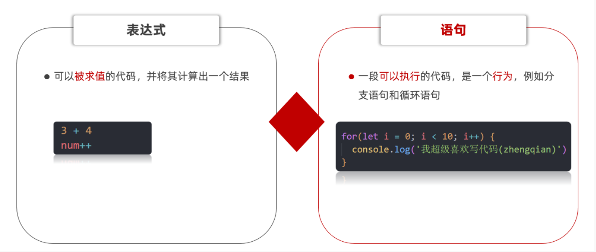

### 分支语句

程序三大流程控制语句

- 以前我们写的代码，写几句就从上往下执行几句，这种叫<mark>顺序结构</mark>

- 有的时候要根据条件选择执行代码，这种就叫<mark>分支结构</mark>

- 某段代码被重复执行，就叫<mark>循环结构</mark>

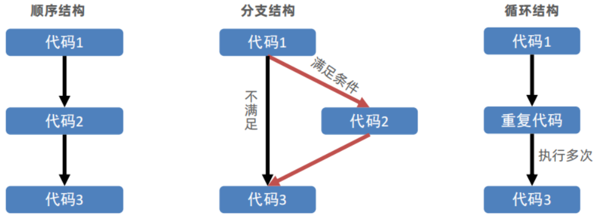

分支语句包含：

1. if分支语句（重点）
2. 三元运算符
3. switch语句

#### if分支语句

##### if单分支语句

语法：

```js
if (条件表达式) {
  // 满足条件要执行的语句
}
```

小括号内的条件结果是布尔值，为 true 时，进入大括号里执行代码；为false，则不执行大括号里面代码

小括号内的结果若不是布尔类型时，会发生类型转换为布尔值，类似Boolean()

如果大括号只有一个语句，大括号可以省略，但是，俺们不提倡这么做~

```js
<script>
    // 单分支语句
    // if (false) {
    //   console.log('执行语句')
    // }
    // if (3 > 5) {
    //   console.log('执行语句')
    // }
    // if (2 === '2') {
    //   console.log('执行语句')
    // }
    //  1. 除了0 所有的数字都为真
    //   if (0) {
    //     console.log('执行语句')
    //   }
    // 2.除了 '' 所有的字符串都为真 true
    // if ('pink老师') {
    //   console.log('执行语句')
    // }
    // if ('') {
    //   console.log('执行语句')
    // }
    // // if ('') console.log('执行语句')

    // 1. 用户输入
    let score = +prompt('请输入成绩')
    // 2. 进行判断输出
    if (score >= 700) {
      alert('恭喜考入黑马程序员')
    }
    console.log('-----------------')

  </script>
```

##### if双分支语句

如果有两个条件的时候，可以使用 if else 双分支语句

```js
if (条件表达式) {
  // 满足条件要执行的语句
} else {
  // 不满足条件要执行的语句
}
```

例如：

```js
<script>
  // 1. 用户输入 let uname = prompt('请输入用户名:') let pwd =
  prompt('请输入密码:') // 2. 判断输出 if (uname === 'pink' && pwd === '123456'){" "}
  {alert("恭喜登录成功")} else {alert("用户名或者密码错误")}
</script>
```

##### if多分支语句

使用场景： 适合于有多个条件的时候

```js
 <script>
    // 1. 用户输入
    let score = +prompt('请输入成绩：')
    // 2. 判断输出
    if (score >= 90) {
      alert('成绩优秀，宝贝，你是我的骄傲')
    } else if (score >= 70) {
      alert('成绩良好，宝贝，你要加油哦~~')
    } else if (score >= 60) {
      alert('成绩及格，宝贝，你很危险~')
    } else {
      alert('成绩不及格，宝贝，我不想和你说话，我只想用鞭子和你说话~')
    }
  </script>
```

#### 三元运算符

**使用场景**： 一些<mark>简单</mark>的双分支，可以使用 三元运算符（三元表达式），写起来比 if else双分支 更简单

**符号**：? 与 : 配合使用

语法：

```js
条件 ? 表达式1 ： 表达式2
```

例如：

```js
// 三元运算符（三元表达式）
// 1. 语法格式
// 条件 ? 表达式1 : 表达式2

// 2. 执行过程
// 2.1 如果条件为真，则执行表达式1
// 2.2 如果条件为假，则执行表达式2

// 3. 验证
// 5 > 3 ? '真的' : '假的'
console.log(5 < 3 ? "真的" : "假的");

// let age = 18
// age = age + 1
//  age++

// 1. 用户输入
let num = prompt("请您输入一个数字:");
// 2. 判断输出- 小于10才补0
// num = num < 10 ? 0 + num : num
num = num >= 10 ? num : 0 + num;
alert(num);
```

#### switch语句

使用场景： 适合于有多个条件的时候，也属于分支语句，大部分情况下和 if多分支语句 功能相同

注意：

1. switch case语句一般用于等值判断, if适合于区间判断
2. switchcase一般需要配合break关键字使用 没有break会造成case穿透
3. if 多分支语句开发要比switch更重要，使用也更多
4. switch与case里面的代码一定要全等，包括类型

```js
// switch分支语句
// 1. 语法
// switch (表达式) {
//   case 值1:
//     代码1
//     break

//   case 值2:
//     代码2
//     break
//   ...
//   default:
//     代码n
// }

<script>
  switch (2) {
    case 1:
    console.log('您选择的是1')
    break  // 退出switch
    case 2:
    console.log('您选择的是2')
    break  // 退出switch
    case 3:
    console.log('您选择的是3')
    break  // 退出switch
    default:
    console.log('没有符合条件的')
  }
</script>
```

**if 多分支语句和 switch的区别：**

1. 共同点
   - 都能实现多分支选择， 多选1
   - 大部分情况下可以互换

2. 区别：
   - switch…case语句通常处理case为比较**确定值**的情况，而if…else…语句更加灵活，通常用于**范围判断**(大于，等于某个范围)。
   - switch 语句进行判断后直接执行到程序的语句，效率更高，而if…else语句有几种判断条件，就得判断多少次
   - switch 一定要注意 必须是 === 全等，一定注意 数据类型，同时注意break否则会有穿透效果
   - 结论：
     - 当分支比较少时，if…else语句执行效率高。
     - 当分支比较多时，switch语句执行效率高，而且结构更清晰。

### 循环语句

重复执行 指定的一段代码

#### 断点调式

作用：学习时可以帮助更好的理解代码运行，工作时可以更快找到bug

浏览器打开调试界面

1. 按F12打开开发者工具
2. 点到源代码一栏 （ sources ）
3. 选择代码文件

断点：在某句代码上加的标记就叫断点，当程序执行到这句有标记的代码时会暂停下来

#### while循环

while : 在…. 期间， 所以 while循环 就是在满足条件期间，重复执行某些代码。

while循环需要具备三要素：

1. 变量起始值

2. 终止条件（没有终止条件，循环会一直执行，造成死循环）

3. 变量变化量（用自增或则自减）

语法：

```js
while (条件表达式) {
  // 循环体
}
```

例如：

```js
// while循环: 重复执行代码

// 1. 需求: 利用循环重复打印3次 '月薪过万不是梦，毕业时候见英雄'
let i = 1;
while (i <= 3) {
  document.write("月薪过万不是梦，毕业时候见英雄~<br>");
  i++; // 这里千万不要忘了变量自增否则造成死循环
}
```

##### 循环退出

目标：说出`continue`和`break`的区别

`break` 中止整个循环，一般用于结果已经得到, 后续的循环不需要的时候可以使用（提高效率）

`continue` 中止本次循环，一般用于排除或者跳过某一个选项的时候

```js
<script>
    // let i = 1
    // while (i <= 5) {
    //   console.log(i)
    //   if (i === 3) {
    //     break  // 退出循环
    //   }
    //   i++

    // }


    let i = 1
    while (i <= 5) {
      if (i === 3) {
        i++
        continue
      }
      console.log(i)
      i++

    }
  </script>
```

#### for循环

##### for循环的基本使用

for循环语法

```js
<script>
  // 1. 语法格式
  // for(起始值; 终止条件; 变化量) {
  //   // 要重复执行的代码
  // }

  // 2. 示例：在网页中输入标题标签
  // 起始值为 1
  // 变化量 i++
  // 终止条件 i <= 6
  for(let i = 1; i <= 6; i++) {
    document.write(`<h${i}>循环控制，即重复执行<h${i}>`)
  }
</script>
```

1. `while(true)`来构造 “无限” 循环，需要使用`break`退出循环。

2. `for(;;)`也可以来构造 ”无线“循环，同样使用`break`退出循环。

结论：

- `JavaScript` 提供了多种语句来实现循环控制，但无论使用哪种语句都离不开循环的3个特征，即起始值、变化量、终止条件，做为初学者应着重体会这3个特征，不必过多纠结三种语句的区别。
- 起始值、变化量、终止条件，由开发者根据逻辑需要进行设计，规避死循环的发生。
- 当如果明确了循环的次数的时候推荐使用`for`循环,当不明确循环的次数的时候推荐使用`while`循环

> 注意：`for` 的语法结构更简洁，故 `for` 循环的使用频次会更多。

##### 循环嵌套

利用循环的知识来对比一个简单的天文知识，我们知道地球在自转的同时也在围绕太阳公转，如果把自转和公转都看成是循环的话，就相当于是循环中又嵌套了另一个循环。



实际上 JavaScript 中任何一种循环语句都支持循环的嵌套，如下代码所示：

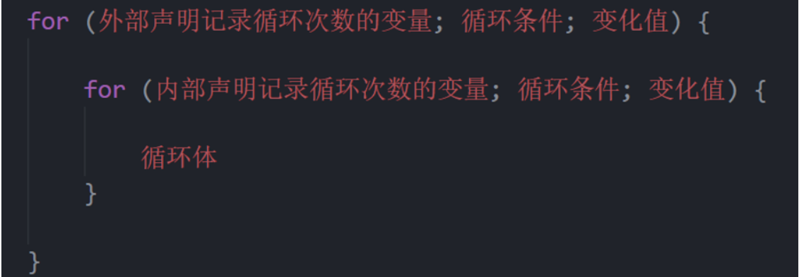

```js
// 1. 外面的循环 记录第n天
for (let i = 1; i < 4; i++) {
  document.write(`第${i}天 <br>`);
  // 2. 里层的循环记录 几个单词
  for (let j = 1; j < 6; j++) {
    document.write(`记住第${j}个单词<br>`);
  }
}
```

> 注意：外层循环循环一次，里层循环循环全部

**九九乘法表**

```css
span {
  display: inline-block;
  width: 100px;
  padding: 5px 10px;
  border: 1px solid pink;
  margin: 2px;
  border-radius: 5px;
  box-shadow: 2px 2px 2px rgba(255, 192, 203, 0.4);
  background-color: rgba(255, 192, 203, 0.1);
  text-align: center;
  color: hotpink;
}
```

```js
// 外层打印几行
for (let i = 1; i <= 9; i++) {
  // 里层打印几个星星
  for (let j = 1; j <= i; j++) {
    // 只需要吧 ★ 换成  1 x 1 = 1
    document.write(`
        <div> ${j} x ${i} = ${j * i} </div>
     `);
  }
  document.write("<br>");
}
```

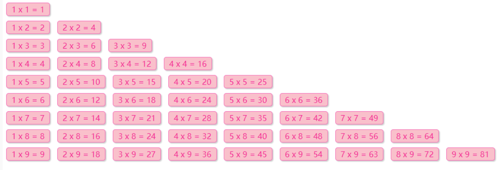

## 综合案例

# JavaScript基础第三天

## 数组

### 数组是什么

(Array)是一种可以按顺序保存数据的数据类型

使用场景：如果有多个数据可以用数组保存起来，然后放到一个变量中，管理非常方便

### 数组的基本使用

语法：

1.字面量生成数组

```js
let arr = [1, 2, "pink", true];
console.log(arr);
```

2.使用`new Array`构造函数声明

```js
let arr = new Array(1, 2, 3, 4);
console.log(arr);
```

- 数组是按顺序保存，所以每个数据都有自己的编号

- 计算机中的编号从0开始，所以小明的编号为0，小刚编号为1，以此类推

- 在数组中，数据的编号也叫索引或下标

- 数组可以存储任意类型的数据

取值语法:

```js
let names = ["小刚", "小明", "小红", "小丽", "小米"];
names[0];
names[1];
```

**遍历数组**

用循环把数组中的每个元素都访问到，一般会用`for`循环遍历

```js
for (let i = 0; i < 数组名.length; i++) {
  数组[i];
}
```

### 操作数组

数组本质是数据集合，操作数据无非就是增删改查语法

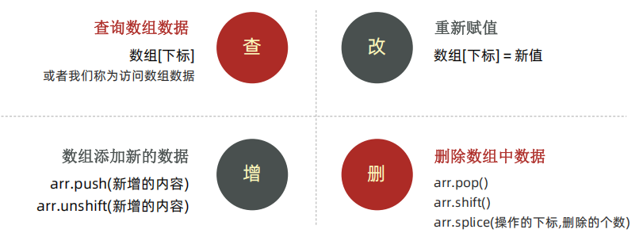

**查询数组数据和重新赋值**

```js
<script>
    let arr = []
    console.log(arr)
    // console.log(arr[0])  // undefined
    arr[0] = 1
    arr[1] = 5
    console.log(arr)
    let arr = ['pink', 'red', 'green']
    // 修改
    arr[0] = 'hotpink'
    console.log(arr)
    // 给所有的数组元素后面加个老师  修改
    for (let i = 0; i < arr.length; i++) {
      // console.log(arr[i])
      arr[i] = arr[i] + '老师'
    }
    console.log(arr)
  </script>
```

**新增和删除数组数据**

数组做为对象数据类型，不但有 `length` 属性可以使用，还提供了许多方法：

1. `push` 动态向数组的<mark>尾部</mark>添加一个单元，<mark>并返回该数组的新长度</mark>
2. `unshit` 动态向数组<mark>头部</mark>添加一个单元，<mark>并返回该数组的新长度</mark>
3. `pop` 删除<mark>最后</mark>一个单元，并返回该元素的值
4. `shift` 删除<mark>第一个</mark>单元，并返回该元素的值
5. `splice` 动态删除任意单元

使用以上4个方法时，都是直接在原数组上进行操作，即成功调任何一个方法，原数组都跟着发生相应的改变。并且在添加或删除单元时 `length` 并不会发生错乱。

```js
<script>
  // 定义一个数组 let arr = ['html', 'css', 'javascript'] // 1. push
  动态向数组的尾部添加一个单元 arr.push('Nodejs') console.log(arr)
  arr.push('Vue') // 2. unshit 动态向数组头部添加一个单元 arr.unshift('VS Code')
  console.log(arr) // 3. splice 动态删除任意单元 arr.splice(2, 1) //
  从索引值为2的位置开始删除1个单元 console.log(arr) arr.splice(1) // 从 green
  删除到最后 // 4. pop 删除最后一个单元 arr.pop() console.log(arr) // 5. shift
  删除第一个单元 arr.shift() console.log(arr)
</script>
```

### 数组案例

## 综合案例

## 冒泡排序

# JavaScript基础第四天

## 函数

### 为什么需要函数

函数：function，是被设计为执行特定任务的代码块。

函数可以把具有相同或相似逻辑的代码“包裹”起来，通过函数调用执行这些被“包裹”的代码逻辑，这么做的优势是有利于

精简代码方便复用。

比如我们前面使用的 alert() 、 prompt() 和 console.log() 都是一些 js 函数，只不过已经封装好了，我们直接使用的。

### 函数使用

声明（定义）一个完整函数包括<u>关键字</u>、<u>函数名</u>、<u>形式参数</u>、<u>函数体</u>、<u>返回值</u>5个部分

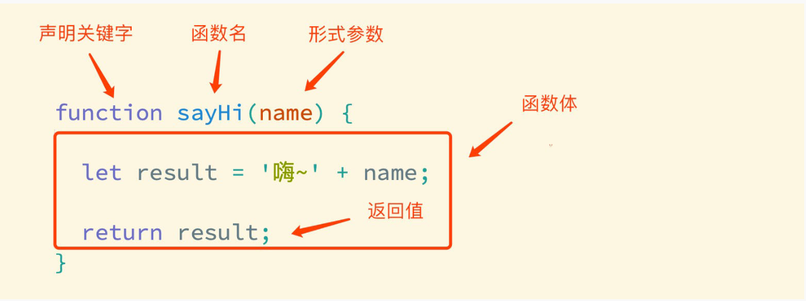

函数名命名规范：

- 和变量命名基本一致

- 尽量小驼峰式命名法

- 前缀应该为动词

- 命名建议：常用**动词约定**

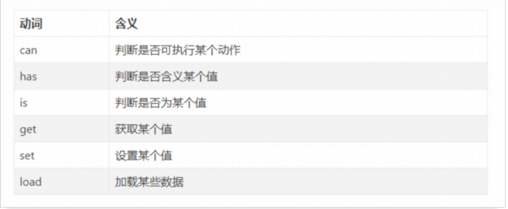

```js
// 1. 函数的声明
function sayHi() {
  console.log("hi~~~");
}
// 2. 函数调用   函数不调用，自己不执行
sayHi();
sayHi();
sayHi();
```

### 函数传参

调用语法：

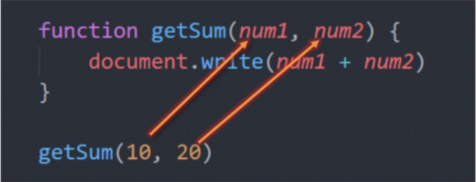

- 形参：声明函数时写在函数名右边小括号里的叫形参（形式上的参数）

- 实参：调用函数时写在函数名右边小括号里的叫实参（实际上的参数）

形参可以理解为是在这个函数内声明的变量（比如 num1 = 10）实参可以理解为是给这个变量赋值

开发中尽量保持形参和实参个数一致

我们曾经使用过的 alert('打印'), parseInt('11'), Number('11') 本质上都是函数调用的传参

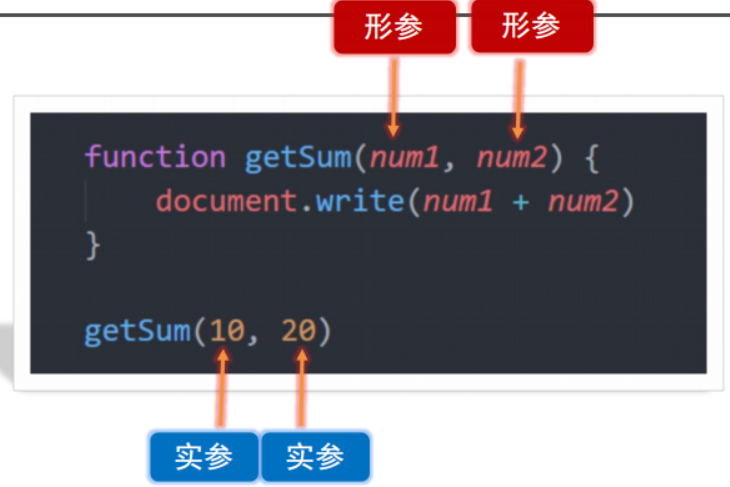

> 注意：形参： 可以看做变量，但是如果一个变量不给值，默认是什么？
>
> undefined
>
> undefined + undefined 结果是什么？
>
> NaN

解决措施，改进

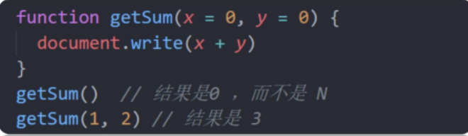

说明：这个默认值只会在缺少实参参数传递时 才会被执行，所以有参数会优先执行传递过来的实参, 否则默认为

undefined

实参也可以是变量

```js
   <script>
        // 求n~m 得累加和
        function getSum(n = 0,m = 0){
            let sum = 0
            for (let i = 0; i < m; i++) {
                sum += i
            }
            console.log(sum);
        }
        let num1 = +prompt('请输入起始值：')
        let num2 = +prompt('请输入结束值：')
        getSum(num1, num2)
    </script>
```

### 函数返回值

函数：是被设计为执行特定任务的代码块

执行完特定任务之后，应该把任务的结果扔给我们

前面已经接触了很多的函数具备返回值：

```js
let result = prompt("请输入您的年龄");
let result2 = parseInt("111");
```

当函数需要返回数据时，用`return`关键字

```js
<script>
    function fn() {
      return 20
    }
    console.log(fn())
</script>
```

完整写法：

```js
function getTotalPrice(x, y) {
  return x + y;
}
let sum = getTotalPrice(1, 2);
console.log(sum);
```

> 在函数体中使用 return 关键字能将内部的执行结果交给函数外部使用
>
> return 后面代码不会再被执行，会立即结束当前函数，所以 return 后面的数据不要换行写
>
> return函数可以没有 return，这种情况函数默认返回值为 undefined

思考：如何返回多个数据？

数组可以存储多个数据

```js
return [max, min];
```

细节补充：

1. 两个相同的函数后面的会覆盖前面的函数

2. 在`Javascript`中 实参的个数和形参的个数可以不一致

3. - 如果形参过多 会自动填上`undefined `(了解即可)
   - 如果实参过多 那么多余的实参会被忽略 (函数内部有一个`arguments`,里面装着所有的实参)

4. 函数一旦碰到`return`就不会在往下执行了 函数的结束用`return`

### 作用域

通常来说，一段程序代码中所用到的名字并不总是有效和可用的，而限定这个名字的可用性的代码范围就是这个名字的作用域。

作用域的使用提高了程序逻辑的局部性，增强了程序的可靠性，减少了名字冲突。

#### 全局作用域

作用于所有代码执行的环境(整个 script 标签内部)或者一个独立的 js 文件

处于全局作用域内的变量，称为全局变量

#### 局部作用域

作用于函数内的代码环境，就是局部作用域。 因为跟函数有关系，所以也称为函数作用域。

处于局部作用域内的变量称为局部变量

> 如果函数内部，变量没有声明，直接赋值，也当全局变量看，但是强烈不推荐
>
> 但是有一种情况，函数内部的形参可以看做是局部变量。

特殊情况：

如果函数内部，变量没有声明，直接赋值，也当**全局变量**看

形参可以看作是函数的局部变量

```js
function fn() {
  num = 10;
}
fn();
console.log(num);
```

### 匿名函数

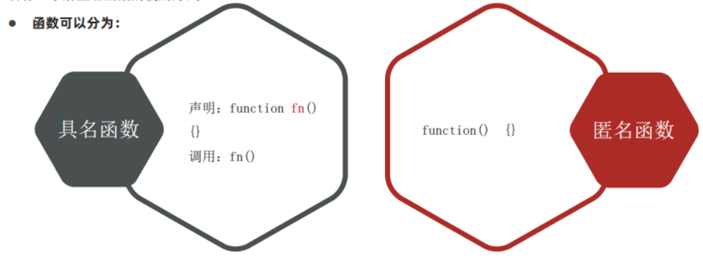

没有名字的函数，无法直接使用

使用方式：

- 函数表达式

- 立即执行函数

#### 函数表达式

将匿名函数赋值给一个变量，并且通过变量名称进行调用，我们将这个称为<mark>函数表达式</mark>

- 具名函数的调用可以写到任何位置

- 函数表达式，必须先写表达式，后调用

语法：

```js
let fn = function () {
  //函数体
};
```

```js
<script>
    let fn = function (x, y){
        console.log(x + y);
    }
    fn(1, 2)
</script>
```

#### 立即执行函数

避免全局变量的污染

语法：立即执行函数之间必须加分号

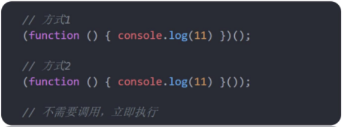

```js
    <script>
        // 1. 第一种写法
        (function (x, y) {
            console.log(x + y)
            let num = 10
            let arr = []
        })(1, 2);

        // 2. 第二种写法
        (function (x, y) {
            let arr = []
            console.log(x + y);
        }(1, 3));
    </script>
```

#### 逻辑中断

都是真则以最后一个真为主

都是假则以最后一个假为主

逻辑与`||`：左边为假则右边不执行

逻辑或`&&`：左边为真则右边不执行

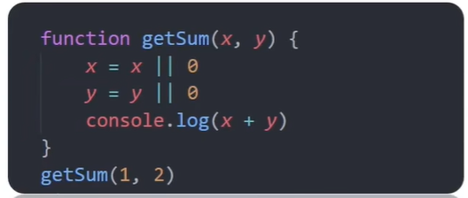

## 转换为布尔型

记忆： `''`、`0`、`undefined`、`null`、`false`、`NaN` 转换为布尔值后都是`false`, 其余则为 `true`

```js
<script>
  console.log(Boolean('pink')) console.log(Boolean('')) console.log(Boolean(0))
  console.log(Boolean(90)) console.log(Boolean(-1))
  console.log(Boolean(undefined)) console.log(Boolean(null))
  console.log(Boolean(NaN)) console.log('--------------------------') let age if
  (age) {console.log(11)}
</script>
```

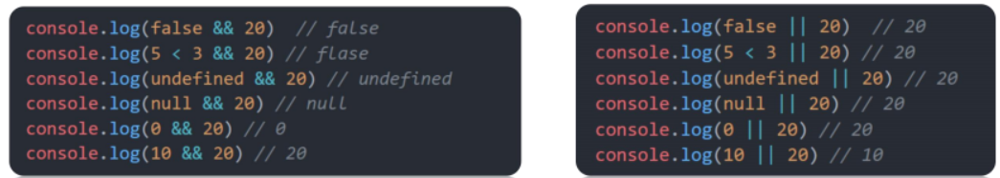

1. 有字符串的加法 “” + 1 ，结果是 “1”

2. 减法 - （像大多数数学运算一样）只能用于数字，它会使空字符串 "" 转换为 0

3. `null` 经过数字转换之后会变为 `0`

4. `undefined `经过数字转换之后会变为 `NaN`

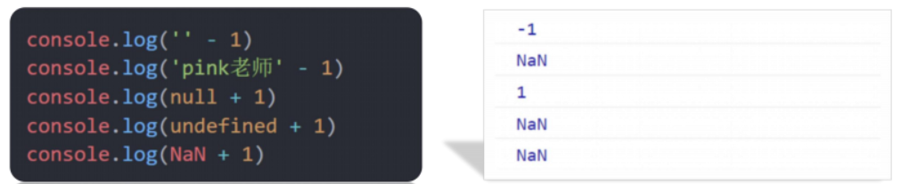

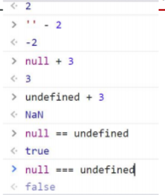

# JavaScript基础第五天

## 对象

### 什么是对象

- 对象（`object`）：`JavaScript`里的一种数据类型

- 可以理解为是一种**无序**的数据集合， 注意数组是**有序**的数据集合

- 用来描述某个事物，例如描述一个人

- - 人有姓名、年龄、性别等信息、还有吃饭睡觉打代码等功能
  - 如果用多个变量保存则比较散，用对象比较统一

- 比如描述 班主任 信息：

- - 静态特征 (姓名, 年龄, 身高, 性别, 爱好) => 可以使用数字, 字符串, 数组, 布尔类型等表示
  - 动态行为 (点名, 唱, 跳, rap) => 使用函数表示

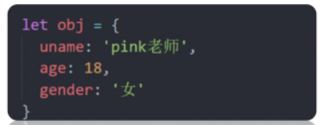

### 对象使用

#### 对象声明语法：

```js
let 对象名 = {};

let 对象名 = new Object();
```

#### 对象有属性和方法组成

- 属性：信息或叫特征（名词）。 比如 手机尺寸、颜色、重量等…

- 方法：功能或叫行为（动词）。 比如 手机打电话、发短信、玩游戏…

```js
let 对象名 = {
    属性名：属性值,
    方法名：函数
}
```

#### 属性

数据描述性的信息称为属性，如人的姓名、身高、年龄、性别等，一般是名词性的。

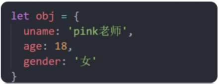

- 属性都是成对出现的，包括属性名和值，它们之间使用英文 : 分隔

- 多个属性之间使用英文 , 分隔

- 属性就是依附在对象上的变量（<mark>外面是变量，对象内是属性</mark>）

- 属性名可以使用 "" 或 ''，一般情况下省略，除非名称遇到特殊符号如空格、中横线等

#### 对象操作

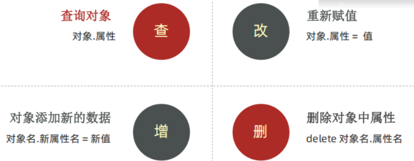

```js
    <script>
        // 1.声明对象
        let pink = {
            uname: 'pink老师',
            age: 18,
            gender: '女'
        }
        console.log(pink)

        let goods = {
            name: '小米10青春版',
            num: 100012816024,
            weight: '0.55kg',
            address: '中国大陆'
        }
        console.log(goods)
        console.log(goods.name)
        console.log(goods.num)
        goods.num = 100
        console.log(goods)
        goods.age = 25
       console.log(goods)

        delete goods.age
        console.log(goods)
    </script>
```

#### 查的另外一种属性

- 对于多词属性或者 - 等属性，点操作就不能用了。

- 我们可以采取： 对象[‘属性’] 方式， 单引号和双引号都阔以

```js
// 1.声明对象
let pink = {
  "user-name": "pink老师",
  age: 18,
  gender: "女",
};
console.log(pink);
console.log(pink["user-name"]);
```

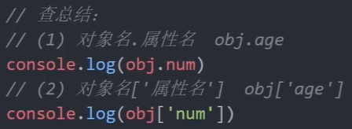

#### 对象方法

数据行为性的信息称为方法，如跑步、唱歌等，一般是动词性的，其本质是函数。

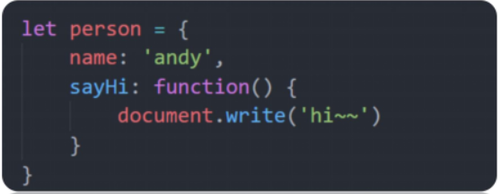

1. 方法是由方法名和函数两部分构成，它们之间使用 : 分隔

2. 多个属性之间使用英文 , 分隔

3. 方法是依附在对象中的函数

4. 方法名可以使用 "" 或 ''，一般情况下省略，除非名称遇到特殊符号如空格、中横线等

### 遍历对象

目标：能够遍历输出对象里面的元素

`for` 遍历对象的问题：

- 对象没有像数组一样的`length`属性,所以无法确定长度

- 对象里面是无序的键值对, 没有规律. 不像数组里面有规律的下标

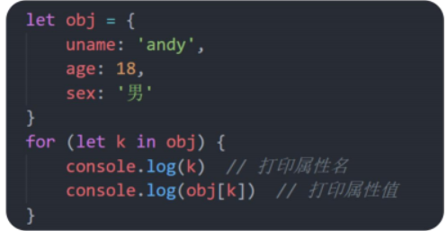

- 一般不用这种方式遍历数组、主要是用来遍历对象

- `for in`语法中的 `k `是一个变量, 在循环的过程中依次代表对象的属性名

- 由于 `k` 是变量, 所以必须使用 [ ] 语法解析

- 一定记住： `k` 是获得对象的属性名， 对象名`[k]` 是获得 属性值

```js
    <script>
        let arr = ['pink', 'red', 'blue']
        for(let k in arr) {
            console.log(k)
            console.log(arr[k])
       }

        let obj = {
            uname: 'pink老师',
            age: 18,
            gender: '男'
        }
        for (let k in obj) {
            console.log(k)
            console.log(obj[k])
        }
    </script>
```

### 内置对象

#### 内置对象是什么

`JavaScript`内部提供的对象，包含各种属性和方法给开发者调用

#### 内置对象Math

- 介绍：Math对象是JavaScript提供的一个“数学”对象

- 作用：提供了一系列做数学运算的方法

- Math对象包含的方法有：

- - random：生成0-1之间的随机数（包含0不包括1）
  - ceil：向上取整
  - floor：向下取整
  - max：找最大数
  - min：找最小数
  - pow：幂运算
  - abs：绝对值
  - [Math对象在线文档](https://developer.mozilla.org/zh-CN/docs/Web/JavaScript/Reference/Global_Objects/Math)

```js
<script>
  // 属性 console.log(Math.PI) // 方法 // ceil 天花板 向上取整
  console.log(Math.ceil(1.1)) // 2 console.log(Math.ceil(1.5)) // 2
  console.log(Math.ceil(1.9)) // 2 // floor 地板 向下取整
  console.log(Math.floor(1.1)) // 1 console.log(Math.floor(1.5)) // 1
  console.log(Math.floor(1.9)) // 1 console.log(Math.floor('12px')) // 1
  console.log('----------------') // 四舍五入 round console.log(Math.round(1.1))
  // 1 console.log(Math.round(1.49)) // 1 console.log(Math.round(1.5)) // 2
  console.log(Math.round(1.9)) // 2 console.log(Math.round(-1.1)) // -1
  console.log(Math.round(-1.5)) // -1 console.log(Math.round(-1.51)) // -2 //
  取整函数 parseInt(1.2) // 1 // 取整函数 parseInt('12px') // 12
  console.log(Math.max(1, 2, 3, 4, 5)) console.log(Math.min(1, 2, 3, 4, 5))
  console.log(Math.abs(-1)); // null 类似 let obj = {}
  let obj = null
</script>
```

#### 生成任意范围随机数

如何生成0-10的随机数呢？

$Math.floor(Math.random() * (10 + 1))$

如何生成5-10的随机数？

$Math.floor(Math.random() * (5 + 1)) + 5$

<mark>如何生成N-M之间的随机数</mark>

$Math.floor(Math.random() * (M - N + 1)) + N$

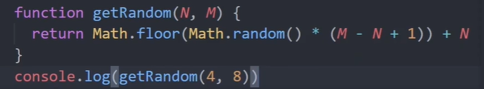

## 拓展-专业术语

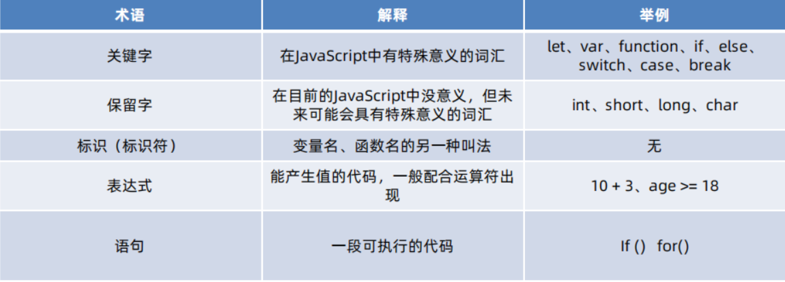

## 拓展- 基本数据类型和引用数据类型

简单类型又叫做基本数据类型或者值类型，复杂类型又叫做引用类型。

1. 值类型：简单数据类型/基本数据类型，在存储时变量中存储的是**值本身**，因此叫做值类型
   string ，number，boolean，undefined，null

2. 引用类型：复杂数据类型，在存储时变量中存储的仅仅是**地址（引用）**，因此叫做引用数据类型
   通过 new 关键字创建的对象（系统对象、自定义对象），如 Object、Array、Date等

堆栈空间分配区别：

1. 栈（操作系统）：由操作系统自动分配释放存放函数的参数值、局部变量的值等。其操作方式类似于数据结构中的栈；
   **简单数据类型存放到栈里面**

2. 堆（操作系统）：存储复杂类型(对象)，一般由程序员分配释放，若程序员不释放，由垃圾回收机制回收。
   **引用数据类型存放到堆里面**

# Web APIs第一天

## Web API基本认知

变量声明：`const`优先

- `const`语义化更好

- 很多变量我们声明的时候就知道他不会被更改了，那为什么不用 `const`呢？

- 实际开发中也是，比如`react`框架，基本`const`

> const声明的值不能更改，而且const声明的变量需要里面进行初始化，但对于引用数据类型，const声明的变量，里面存的不是值，是地址

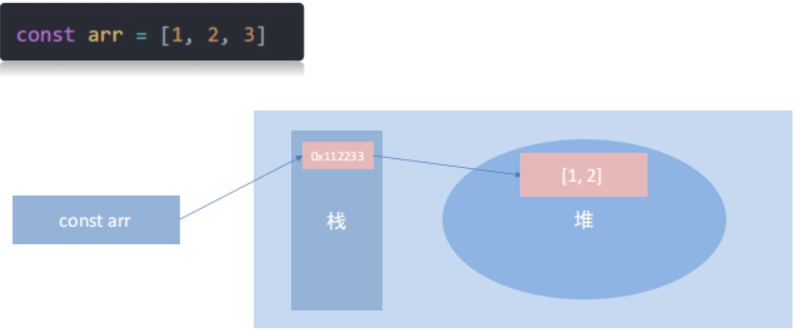

### 作用和分类

就是使用`js`去操作`html`和浏览器

> 知道 ECMAScript 与 JavaScript 的关系，Web APIs 是浏览器扩展的功能。

严格意义上讲，我们在 `JavaScript` 阶段学习的知识绝大部分属于` ECMAScript` 的知识体系，`ECMAScript` 简称 ES 它提供了一套语言标准规范，如变量、数据类型、表达式、语句、函数等语法规则都是由 `ECMAScript` 规定的。浏览器将 `ECMAScript` 大部分的规范加以实现，并且在此基础上又扩展一些实用的功能，这些被扩展出来的内容我们称为 `Web APIs`。

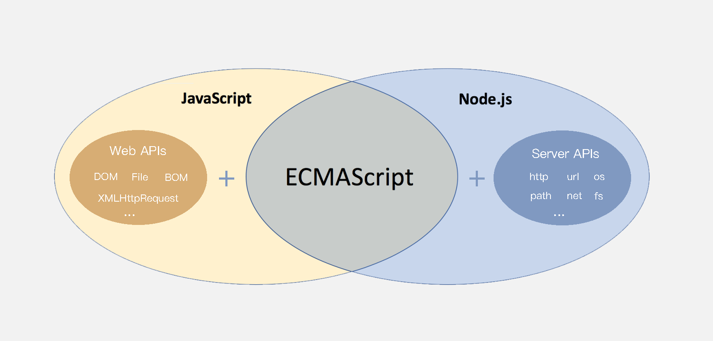

`ECMAScript` 运行在浏览器中然后再结合 `Web APIs` 才是真正的` JavaScript`，`Web APIs` 的核心是 `DOM` 和 `BOM`。

扩展阅读：ECMAScript 规范在不断的更新中，存在多个不同的版本，早期的版本号采用数字顺序编号如 ECMAScript3、ECMAScript5，后来由于更新速度较快便采用年份做为版本号，如 ECMAScript2017、ECMAScript2018 这种格式，ECMAScript6 是 2015 年发布的，常叫做 EMCAScript2015。

关于 JavaScript 历史的[扩展阅读](https://javascript.ruanyifeng.com/introduction/history.html)。

### 什么是DOM

DOM文档对象模型：是用来呈现以及任意HTML或XML文档交互的API

DOM（Document Object Model）是将整个 HTML 文档的每一个标签元素视为一个对象，这个对象下包含了许多的属性和方法，通过操作这些属性或者调用这些方法实现对 HTML 的动态更新，为实现网页特效以及用户交互提供技术支撑。

简言之 DOM 是用来动态修改 HTML 的，其目的是开发网页特效及用户交互。

观察一个小例子：

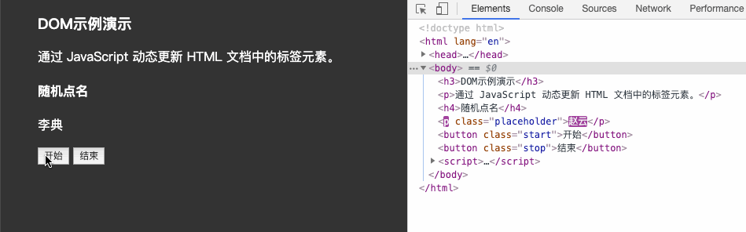

上述的例子中当用户分分别点击【开始】或【结束】按钮后，通过右侧调试窗口可以观察到 html 标签的内容在不断的发生改变，这便是通过 DOM 实现的。

### DOM树

将 HTML 文档以树状结构直观的表现出来，我们称之为<mark>文档树</mark>或 <mark>DOM 树</mark>

作用：文档树直观的体现了标签与标签之间的关系

```js
<!DOCTYPE html>
<html lang="en">
<head>
  <meta charset="UTF-8">
  <meta name="viewport" content="width=device-width, initial-scale=1.0">
  <title>标题</title>
</head>
<body>
  文本
  <a href="">链接名</a>
  <div id="" class="">文本</div>
</body>
</html>
```

如下图所示，将 HTML 文档以树状结构直观的表现出来，我们称之为文档树或 DOM 树，文档树直观的体现了标签与标签之间的关系。

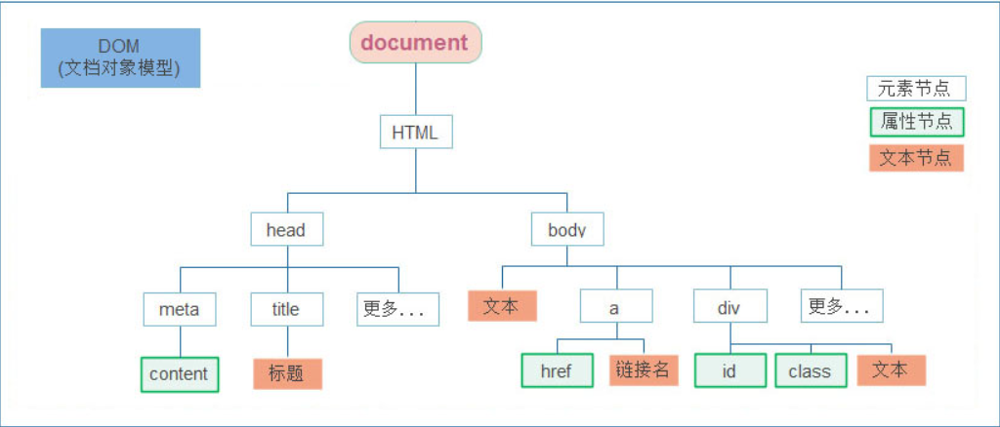

DOM节点：节点是文档树的组成部分，**每一个节点都是一个 DOM 对象**，主要分为元素节点、属性节点、文本节点等。

1. 【元素节点】其实就是 HTML 标签，如上图中 `head`、`div`、`body` 等都属于元素节点。
2. 【属性节点】是指 HTML 标签中的属性，如上图中 `a` 标签的 `href` 属性、`div` 标签的 `class` 属性。
3. 【文本节点】是指 HTML 标签的文字内容，如 `title` 标签中的文字。
4. 【根节点】特指 `html` 标签。
5. 其它...

### DOM对象

- DOM对象：浏览器根据html标签生成的 JS对象
  所有的标签属性都可以在这个对象上面找到
  修改这个对象的属性会自动映射到标签身上

- DOM的核心思想：把网页内容当做对象来处理

- document 对象：是 DOM 里提供的一个对象
  所以它提供的属性和方法都是用来访问和操作网页内容的，例：document.write()

- 网页所有内容都在document里面

```html
<body>
  <div>123</div>
  <script>
    const div = document.querySelector("div");
    // 打印对象
    console.dir(div); // dom 对象
  </script>
</body>
```

## 获取DOM对象

### 根据CSS选择器来获取DOM元素

语法：

选择匹配的单个元素：

```js
document.querySelector("css选择器");
```

参数：包含一个或多个有效的CSS选择器 字符串

`CSS`选择器匹配的第一个元素,一个 `HTMLElement`对象。

如果没有匹配到，则返回`null`。

```html
<body>
  <div class="box">123</div>
  <div class="box">abc</div>
  <p id="nav">导航栏</p>
  <ul>
    <li>测试1</li>
    <li>测试2</li>
    <li>测试3</li>
  </ul>
  <script>
    const box = document.querySelector("div");
    // const box = document.querySelector('.box')
    console.log(box);

    const nav = document.querySelector("#nav");
    console.log(nav);
    nav.style.color = "red";

    const li = document.querySelector("ul li:first-child");
    console.log(li);
  </script>
</body>
```

选择匹配的多个元素：

```js
document.querySelectorAll("css选择器");
```

参数：包含一个或多个有效的`CSS`选择器 字符串

返回值：`CSS`选择器匹配的`NodeList`对象集合

```js
<body>
  <ul>
    <li>测试1</li>
    <li>测试2</li>
    <li>测试3</li>
  </ul>
  <script>
    const lis = document.querySelectorAll('ul li') console.log(lis)
  </script>
</body>
```

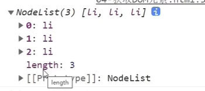

得到的是一个<mark>伪数组</mark>：

- 有长度有索引号的数组

- 但是没有 `pop()` `push()` 等数组方法

想要得到里面的每一个对象，则需要**遍历**（for）的方式获得。

### 其它获取DOM元素的方法

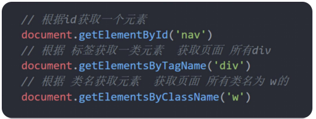

## 操作元素内容

通过修改 DOM 的文本内容，动态改变网页的内容。

1. `innerText` 将文本内容添加/更新到任意标签位置，\*\*文本中包含的标签不会被解析。

```js
<script>
  // innerText 将文本内容添加/更新到任意标签位置 const intro =
  document.querySelector('.intro') // intro.innerText = '嗨~ 我叫李雷！' //
  intro.innerText = '<h4>嗨~ 我叫李雷！</h4>'
</script>
```

2.`innerHTML` 将文本内容添加/更新到任意标签位置，**文本中包含的标签会被解析\*\***。

```js
<script>
  // innerHTML 将文本内容添加/更新到任意标签位置 const intro =
  document.querySelector('.intro') intro.innerHTML = '嗨~ 我叫韩梅梅！'
  intro.innerHTML = '<h4>嗨~ 我叫韩梅梅！</h4>'
</script>
```

总结：如果文本内容中包含 `html` 标签时推荐使用 `innerHTML`，否则建议使用 `innerText` 属性。

## 操作元素属性

### 操作元素常用属性

最常见的属性比如： href、title、src 等

语法：


```html
<body>
  
  <script>
    // 1.获取图片元素
    const img = document.querySelector("img");
    img.src = "./images/2.webp";
    img.title = "pink老师的艺术照";
  </script>
</body>
```

### 操作元素样式属性

#### 1.通过style属性操作css

语法：


```html
<!DOCTYPE html>
<html lang="en">
  <head>
    <meta charset="UTF-8" />
    <meta name="viewport" content="width=device-width, initial-scale=1.0" />
    <title>Document</title>
    <style>
      .box {
        width: 200px;
        height: 200px;
        background-color: pink;
      }
    </style>
  </head>
  <body>
    <div class="box"></div>
    <script>
      // 1.获取元素
      const box = document.querySelector(".box");
      // 2.修改样式属性 对象.style.样式属性 = '值' 别忘了跟单位
      box.style.width = "300px";
      // 多组单词的采用 小驼峰命名法
      box.style.backgroundColor = "hotpink";
      box.style.border = "2px solid blue";
      box.style.borderTop = "2px solid red";
    </script>
  </body>
</html>
```

#### 2.操作类名(className)操作CSS

使用场景：如果修改的样式比较多，直接通过`style`属性修改比较繁琐，我们可以通过借助`css`类名的形式
语法：

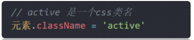

```html
<!DOCTYPE html>
<html lang="en">
  <head>
    <meta charset="UTF-8" />
    <meta name="viewport" content="width=device-width, initial-scale=1.0" />
    <title>Document</title>
    <style>
      .nav {
        color: blue;
      }
      div {
        width: 200px;
        height: 200px;
        background-color: pink;
      }
      .box {
        width: 300px;
        height: 300px;
        background-color: skyblue;
        margin: 100px auto;
        padding: 10px;
        border: 1px solid #000;
      }
    </style>
  </head>
  <body>
    <div class="nav">123</div>
    <script>
      const div = document.querySelector("div");
      div.className = "nav box";
    </script>
  </body>
</html>
```

#### 3.通过classList操作类控制CSS

为了解决className 容易覆盖以前的类名，我们可以通过classList方式追加和删除类名

语法：

<mark>一定要注意：后面加的类名不能加.</mark>

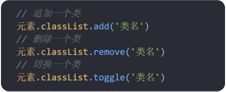

元素.classList.contains() 看看有没有包含某个类，如果有则返回`true`，么有则返回`false`

```js
<!DOCTYPE html>
<html lang="en">
<head>
    <meta charset="UTF-8">
    <meta name="viewport" content="width=device-width, initial-scale=1.0">
    <title>Document</title>
    <style>
        .box {
            width: 200px;
            height: 200px;
            color: #333;
        }

        .active {
            color: red;
            background-color: pink;
        }
    </style>
</head>
<body>
    <div class="box">文字</div>
    <script>
        // 通过classList添加
        // 1.获取元素
        const box = document.querySelector('.box')
        // 2.修改样式


        // 2.1追加类 add() 类名不加点，并且是字符串
        // box.classList.add('active')

        // 2.2删除类 remove() 类名不加点，并且是字符串
        // box.classList.remove('box')

        // 2.3切换类 toggle() 有还是没有啊， 有就删掉，没有就加上
        box.classList.toggle('active')
    </script>
</body>
</html>
```

### 操作表单元素属性

表单很多情况，也需要修改属性，比如点击眼睛，可以看到密码，本质是把表单类型转换为文本框

获取-设置：`DOM`对象.属性名 = 新值

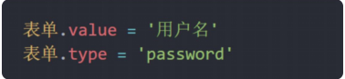

```html
    
<body>
      <input type="checkbox" name="" id="" />     
  <script>
    // 1.获取元素
    const uname = document.querySelector("input");
    // 2.获取值 获取表单里面的值  用的 表单.value
    console.log(uname.value);
    // 3.设置表单的值
    uname.value = "我要买电脑";
    console.log(uname.type);
    uname.type = "password";
  </script>
      
</body>
```

表单属性中添加就有效果,移除就没有效果,一律使用布尔值表示 如果为true 代表添加了该属性 如果是false 代表移除了该属性

比如： disabled、checked、selected

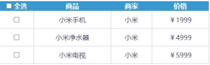

```html
<body>
  <input type="checkbox" />
  <script>
    // 1. 获取
    const ipt = document.querySelector("input");
    // console.log(ipt.checked)  // false   只接受布尔值
    ipt.checked = true;
    // ipt.checked = 'true'  // 会选中，不提倡  有隐式转换
  </script>
</body>
```

```html
<body>
      <button>点击</button>
  <script>
    // 1.获取
    const button = document.querySelector("button");
    // console.log(button.disabled)  // 默认false 不禁用
    button.disabled = true; // 禁用按钮
  </script>
</body>
```

### 自定义属性

标准属性：标签天生自带的属性 比如`class` `id` `title`等, 可以直接使用点语法操作比如： `disabled`、`checked`、

`selected`

自定义属性：

- 在`html5`中推出来了专门的`data-`自定义属性

- 在标签上一律以`data-`开头

- 在`DOM`对象上一律以`dataset`对象方式获取

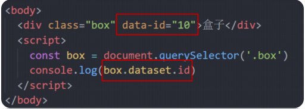

```html
<!DOCTYPE html>
<html lang="en">
  <head>
    <meta charset="UTF-8" />
    <meta name="viewport" content="width=device-width, initial-scale=1.0" />
    <title>Document</title>
  </head>
  <body>
    <div data-id="1" data-spm="不知道">1</div>
    <div data-id="2">2</div>
    <div data-id="3">3</div>
    <div data-id="4">4</div>
    <div data-id="5">5</div>
    <script>
      const one = document.querySelector("div");
      console.log(one.dataset.id);
      console.log(one.dataset.spm);
    </script>
  </body>
</html>
```

## 定时器-间歇函数

### 定时器函数介绍

网页中经常会需要一种功能：每隔一段时间需要自动执行一段代码，不需要我们手动去触发，例如：网页中的倒计时

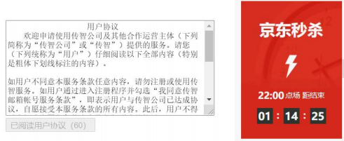

### 定时器函数基本使用

定时器函数可以开启和关闭定时器

#### 1.开启定时器

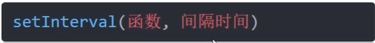

每隔一段时间调用这个函数，间隔时间单位是毫秒

匿名函数写法：

```html
<body>
  <script>
    setInterval(function () {
      console.log("每秒执行一次");
    }, 1000);
  </script>
</body>
```

具名函数写法：`fn`函数放在`setInterval`里面一定不能写()

```html
<body>
  <script>
    function fn() {
      console.log("每秒执行一次");
    }
    setInterval(fn, 1000);
    // setInterval('fn()',1000)
  </script>
</body>
```

#### 2.关闭定时器

注意：定时器返回的是一个id数字

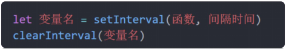

```html
<body>
  <script>
    function fn() {
      console.log("每秒执行一次");
    }
    let n = setInterval(fn, 1000);
    console.log(n);
    clearInterval(n);
  </script>
</body>
```

## 综合案例

轮播图：

```html
<body>
  <div class="slider">
    <div class="slider-wrapper">
      
    </div>
    <div class="slider-footer">
      <p>对人类来说会不会太超前了？</p>
      <ul class="slider-indicator">
        <li class="active"></li>
        <li></li>
        <li></li>
        <li></li>
        <li></li>
        <li></li>
        <li></li>
        <li></li>
      </ul>
      <div class="toggle">
        <button class="prev"><</button>
        <button class="next">></button>
      </div>
    </div>
  </div>
  <script>
    // 1. 初始数据
    const sliderData = [
      {
        url: "./images/slider01.jpg",
        title: "对人类来说会不会太超前了？",
        color: "rgb(100, 67, 68)",
      },
      {
        url: "./images/slider02.jpg",
        title: "开启剑与雪的黑暗传说！",
        color: "rgb(43, 35, 26)",
      },
      {
        url: "./images/slider03.jpg",
        title: "真正的jo厨出现了！",
        color: "rgb(36, 31, 33)",
      },
      {
        url: "./images/slider04.jpg",
        title: "李玉刚：让世界通过B站看到东方大国文化",
        color: "rgb(139, 98, 66)",
      },
      {
        url: "./images/slider05.jpg",
        title: "快来分享你的寒假日常吧~",
        color: "rgb(67, 90, 92)",
      },
      {
        url: "./images/slider06.jpg",
        title: "哔哩哔哩小年YEAH",
        color: "rgb(166, 131, 143)",
      },
      {
        url: "./images/slider07.jpg",
        title: "一站式解决你的电脑配置问题！！！",
        color: "rgb(53, 29, 25)",
      },
      {
        url: "./images/slider08.jpg",
        title: "谁不想和小猫咪贴贴呢！",
        color: "rgb(99, 72, 114)",
      },
    ];

    const img = document.querySelector(".slider-wrapper img");
    const p = document.querySelector(".slider-footer p");
    const footer = document.querySelector(".slider-footer");

    let i = 0;
    setInterval(function () {
      i++;
      if (i >= sliderData.length) {
        i = 0;
      }
      img.src = sliderData[i].url;
      p.innerHTML = sliderData[i].title;
      footer.style.backgroundColor = sliderData[i].color;
      document
        .querySelector(".slider-indicator .active")
        .classList.remove("active");
      document
        .querySelector(`.slider-indicator li:nth-child(${i + 1})`)
        .classList.add("active");
    }, 1000);
  </script>
</body>
```

# Web APIs第二天

## 事件监听（绑定）

### 事件监听

1.什么是事件？

事件是在编程时系统内发生的动作或者发生的事情，比如用户在网页上单击一个按钮

2.什么是事件监听？

就是让程序检测是否有事件产生，一旦有事件触发，就立即调用一个函数做出响应，也称为 **绑定事件**或者**注册事件**。比如鼠标经过显示下拉菜单，比如点击可以播放轮播图等等

语法：


- 事件源： 那个`dom`元素被事件触发了，要获取`dom`元素

- 事件类型： 用什么方式触发，比如鼠标单击 `click`、鼠标经过 `mouseover` 等

- 事件调用的函数： 要做什么事

```html
<!DOCTYPE html>
<html lang="en">
  <head>
    <meta charset="UTF-8" />
    <meta name="viewport" content="width=device-width, initial-scale=1.0" />
    <title>Document</title>
  </head>
  <body>
    <button>点击</button>
    <script>
      const btn = document.querySelector("button");
      btn.addEventListener("click", function () {
        alert("点击了按钮");
      });
    </script>
  </body>
</html>
```

### 拓展阅读-时间监听版本

- DOM L0 ：是 DOM 的发展的第一个版本； L：level

- DOM L1：DOM级别1 于1998年10月1日成为W3C推荐标准

- DOM L2：使用addEventListener注册事件

- DOM L3： DOM3级事件模块在DOM2级事件的基础上重新定义了这些事件，也添加了一些新事件类型

## 事件类型

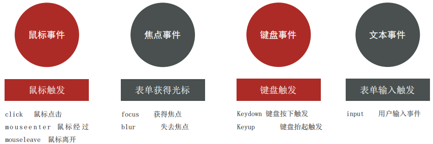

### 1.鼠标事件

```html
<!DOCTYPE html>
<html lang="en">
  <head>
    <meta charset="UTF-8" />
    <meta name="viewport" content="width=device-width, initial-scale=1.0" />
    <title>Document</title>
    <style>
      div {
        width: 200px;
        height: 200px;
        background-color: pink;
      }
    </style>
  </head>
  <body>
    <div></div>
    <script>
      const div = document.querySelector("div");
      div.addEventListener("mouseenter", function () {
        console.log("我进来了");
      });
      div.addEventListener("mouseleave", function () {
        console.log("我走了");
      });
    </script>
  </body>
</html>
```

### 2.焦点事件

```html
<!DOCTYPE html>
<html lang="en">
  <head>
    <meta charset="UTF-8" />
    <meta name="viewport" content="width=device-width, initial-scale=1.0" />
    <title>Document</title>
  </head>
  <body>
    <input type="text" />
    <script>
      const input = document.querySelector("input");
      input.addEventListener("focus", function () {
        console.log("有焦点触发");
      });
      input.addEventListener("blur", function () {
        console.log("焦点失去");
      });
    </script>
  </body>
</html>
```

### 3.键盘事件

```html
<!DOCTYPE html>
<html lang="en">
  <head>
    <meta charset="UTF-8" />
    <meta name="viewport" content="width=device-width, initial-scale=1.0" />
    <title>Document</title>
  </head>
  <body>
    <input type="text" />
    <script>
      const input = document.querySelector("input");
      input.addEventListener("keydown", function () {
        console.log("键盘按下了");
      });
      input.addEventListener("keyup", function () {
        console.log("键盘弹起了");
      });
    </script>
  </body>
</html>
```

### 4.文本事件

```html
<!DOCTYPE html>
<html lang="en">
  <head>
    <meta charset="UTF-8" />
    <meta name="viewport" content="width=device-width, initial-scale=1.0" />
    <title>Document</title>
  </head>
  <body>
    <input type="text" />
    <script>
      const input = document.querySelector("input");
      input.addEventListener("input", function () {
        console.log(input.value);
      });
    </script>
  </body>
</html>
```

## 事件对象

也是个**对象**，这个对象里有事件触发时的**相关信息** 例如：鼠标点击事件中，事件对象就存了鼠标点在哪个位置等信息

使用场景：可以判断用户按下哪个键，比如按下回车键可以发布新闻

语法：在事件绑定的回调函数的第一个参数就是事件对象，一般命名为event、ev、e

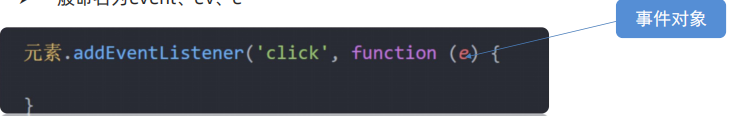

```html
<!DOCTYPE html>
<html lang="en">
  <head>
    <meta charset="UTF-8" />
    <meta name="viewport" content="width=device-width, initial-scale=1.0" />
    <title>Document</title>
  </head>
  <body>
    <button>点击</button>
    <script>
      const btn = document.querySelector("button");
      btn.addEventListener("click", function (e) {
        console.log(e);
      });
    </script>
  </body>
</html>
```

事件对象的常见属性：

1. `ev.type` 当前事件的类型
2. `ev.clientX/Y` 光标相对浏览器窗口的位置，放大镜效果
3. `ev.offsetX/Y` 光标相于当前 DOM 元素的位置
4. `ev.key`用户按下的键盘键的值

注：在事件回调函数内部通过 window.event 同样可以获取事件对象。

### trim方法

清除前后的空格

```html
<!DOCTYPE html>
<html lang="en">
  <head>
    <meta charset="UTF-8" />
    <meta http-equiv="X-UA-Compatible" content="IE=edge" />
    <meta name="viewport" content="width=device-width, initial-scale=1.0" />
    <title>Document</title>
  </head>

  <body>
    <textarea name="" id="" cols="30" rows="10"></textarea>
    <script>
      const str = "          im a teacher  ";
      // console.log(str.trim())  // 去除字符串左右的空格
      const tx = document.querySelector("textarea");
      tx.addEventListener("keyup", function (e) {
        // console.log(tx.value)
        if (e.key === "Enter") {
          // console.log(tx.value)
          console.log(tx.value.trim() === "");
        }
      });
    </script>
  </body>
</html>
```

## 环境对象

指的是函数内部特殊的<mark>变量 this </mark>，它代表着**当前函数运行时所处的环境**

每个函数里面都有个`this`，谁调用这个函数，`this`就指向谁

作用：弄清楚`this`的指向，可以让我们代码更简洁

- 函数的调用方式不同，`this` 指代的对象也不同

- <mark>【谁调用， `this` 就是谁】</mark> 是判断 `this` 指向的粗略规则

- 直接调用函数，其实相当于是 `window.`函数，所以 `this` 指代 `window`

```html
<!DOCTYPE html>
<html lang="en">
  <head>
    <meta charset="UTF-8" />
    <meta name="viewport" content="width=device-width, initial-scale=1.0" />
    <title>Document</title>
  </head>
  <body>
    <button>点击</button>
    <script>
      // function fn() {
      //     console.log(this)
      // }
      // fn()
      // window.fn()

      const btn = document.querySelector("button");
      btn.addEventListener("click", function () {
        // console.log(this)  // btn 对象
        // btn.style.color = 'red'
        this.style.color = "red";
      });
    </script>
  </body>
</html>
```

## 回调函数

如果将函数 A 做为参数传递给函数 B 时，我们称函数 A 为回调函数

简单理解： 当一个函数当做参数来传递给另外一个函数的时候，这个函数就是回调函数

使用场景：

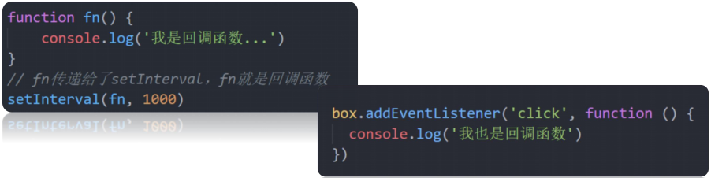

## 综合案例

### tab栏切换

```html
<!DOCTYPE html>
<html lang="en">
  <head>
    <meta charset="UTF-8" />
    <meta http-equiv="X-UA-Compatible" content="IE=edge" />
    <meta name="viewport" content="width=device-width, initial-scale=1.0" />
    <title>tab栏切换</title>
    <style>
      * {
        margin: 0;
        padding: 0;
      }

      .tab {
        width: 590px;
        height: 340px;
        margin: 20px;
        border: 1px solid #e4e4e4;
      }

      .tab-nav {
        width: 100%;
        height: 60px;
        line-height: 60px;
        display: flex;
        justify-content: space-between;
      }

      .tab-nav h3 {
        font-size: 24px;
        font-weight: normal;
        margin-left: 20px;
      }

      .tab-nav ul {
        list-style: none;
        display: flex;
        justify-content: flex-end;
      }

      .tab-nav ul li {
        margin: 0 20px;
        font-size: 14px;
      }

      .tab-nav ul li a {
        text-decoration: none;
        border-bottom: 2px solid transparent;
        color: #333;
      }

      .tab-nav ul li a.active {
        border-color: #e1251b;
        color: #e1251b;
      }

      .tab-content {
        padding: 0 16px;
      }

      .tab-content .item {
        display: none;
      }

      .tab-content .item.active {
        display: block;
      }
    </style>
  </head>

  <body>
    <div class="tab">
      <div class="tab-nav">
        <h3>每日特价</h3>
        <ul>
          <li><a class="active" href="javascript:;">精选</a></li>
          <li><a href="javascript:;">美食</a></li>
          <li><a href="javascript:;">百货</a></li>
          <li><a href="javascript:;">个护</a></li>
          <li><a href="javascript:;">预告</a></li>
        </ul>
      </div>
      <div class="tab-content">
        <div class="item active"></div>
        <div class="item"></div>
        <div class="item"></div>
        <div class="item"></div>
        <div class="item"></div>
      </div>
    </div>

    <script>
      const as = document.querySelectorAll(".tab-nav a");
      for (let i = 0; i < as.length; i++) {
        as[i].addEventListener("mouseenter", function () {
          document.querySelector(".tab-nav .active").classList.remove("active");
          this.classList.add("active");

          document
            .querySelector(".tab-content .active")
            .classList.remove("active");
          document
            .querySelector(`.tab-content .item:nth-child(${i + 1})`)
            .classList.add("active");
        });
      }
    </script>
  </body>
</html>
```

### 全选文本框案例

css伪类选择器

选中了之后才发生变化

```html
<!DOCTYPE html>
<html lang="en">
  <head>
    <meta charset="UTF-8" />
    <meta name="viewport" content="width=device-width, initial-scale=1.0" />
    <title>Document</title>
    <style>
      .ck:checked {
        width: 20px;
        height: 20px;
      }
    </style>
  </head>
  <body>
    <input type="checkbox" class="ck" />
    <input type="checkbox" class="ck" />
    <input type="checkbox" class="ck" />
    <input type="checkbox" class="ck" />
    <input type="checkbox" class="ck" />
  </body>
</html>
```

```html
<!DOCTYPE html>

<html>
  <head lang="en">
    <meta charset="UTF-8" />
    <title></title>
    <style>
      * {
        margin: 0;
        padding: 0;
      }

      table {
        border-collapse: collapse;
        border-spacing: 0;
        border: 1px solid #c0c0c0;
        width: 500px;
        margin: 100px auto;
        text-align: center;
      }

      th {
        background-color: #09c;
        font: bold 16px "微软雅黑";
        color: #fff;
        height: 24px;
      }

      td {
        border: 1px solid #d0d0d0;
        color: #404060;
        padding: 10px;
      }

      .allCheck {
        width: 80px;
      }
    </style>
  </head>

  <body>
    <table>
      <tr>
        <th class="allCheck">
          <input type="checkbox" name="" id="checkAll" />
          <span class="all">全选</span>
        </th>
        <th>商品</th>
        <th>商家</th>
        <th>价格</th>
      </tr>
      <tr>
        <td>
          <input type="checkbox" name="check" class="ck" />
        </td>
        <td>小米手机</td>
        <td>小米</td>
        <td>￥1999</td>
      </tr>
      <tr>
        <td>
          <input type="checkbox" name="check" class="ck" />
        </td>
        <td>小米净水器</td>
        <td>小米</td>
        <td>￥4999</td>
      </tr>
      <tr>
        <td>
          <input type="checkbox" name="check" class="ck" />
        </td>
        <td>小米电视</td>
        <td>小米</td>
        <td>￥5999</td>
      </tr>
    </table>
    <script>
      const checkAll = document.querySelector("#checkAll");
      const checks = document.querySelectorAll(".ck");

      checkAll.addEventListener("click", function () {
        for (let i = 0; i < checks.length; i++) {
          checks[i].checked = this.checked;
        }
      });

      for (let i = 0; i < checks.length; i++) {
        checks[i].addEventListener("click", function () {
          // document.querySelectorAll('.ck:checked').length === checks.length ? checkAll.checked = true : checkAll.checked = false
          checkAll.checked =
            document.querySelectorAll(".ck:checked").length === checks.length;
        });
      }
    </script>
  </body>
</html>
```

# Web APIs第三天

## 事件流

### 事件流与两个阶段说明

事件流是对事件完整执行过程中的**流动路径**，了解事件的执行过程有助于加深对事件的理解，提升开发实践中对事件运用的灵活度。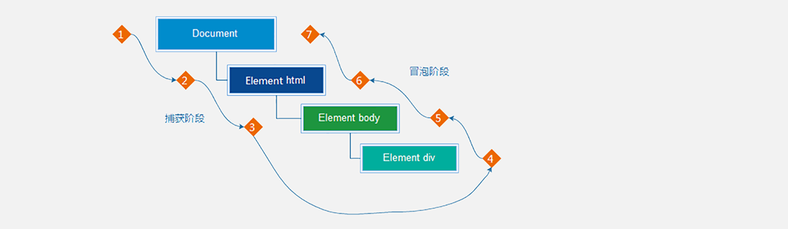

如上图所示，任意事件被触发时总会经历两个阶段：【捕获阶段】和【冒泡阶段】。

简言之，捕获阶段是【从父到子】的传导过程，冒泡阶段是【从子向父】的传导过程。

### 事件捕获

从`DOM`的<mark>根元素</mark>开始去执行对应的事件 (<mark>从外到里，从上往下</mark>)

注意：事件捕获需要写对应代码才能看到效果

语法：

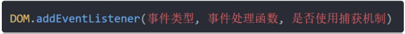

- `addEventListener`第三个参数传入 `true` 代表是捕获阶段触发（很少使用）

- 若传入`false`代表冒泡阶段触发，默认就是`false`

```html
<!DOCTYPE html>
<html lang="en">
  <head>
    <meta charset="UTF-8" />
    <meta http-equiv="X-UA-Compatible" content="IE=edge" />
    <meta name="viewport" content="width=device-width, initial-scale=1.0" />
    <title>Document</title>
    <style>
      .father {
        width: 500px;
        height: 500px;
        background-color: pink;
      }

      .son {
        width: 200px;
        height: 200px;
        background-color: purple;
      }
    </style>
  </head>

  <body>
    <div class="father">
      <div class="son"></div>
    </div>

    <script>
      const father = document.querySelector(".father");
      const son = document.querySelector(".son");

      document.addEventListener(
        "click",
        function () {
          alert("我是爷爷");
        },
        true,
      );
      father.addEventListener(
        "click",
        function () {
          alert("我是爸爸");
        },
        true,
      );
      son.addEventListener(
        "click",
        function () {
          alert("我是儿子");
        },
        true,
      );
    </script>
  </body>
</html>
```

### 事件冒泡

- 当一个元素的事件被触发时，同样的事件将会在该元素的所有祖先元素中依次被触发。这一过程被称为事件冒泡<mark>（从下往上） </mark>

- 当一个元素触发事件后，会依次向上调用所有父级元素的 同名事件

- 事件冒泡是<mark>默认存在</mark>的

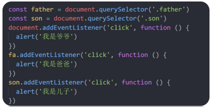

### 阻止冒泡

因为默认就有冒泡模式的存在，所以容易导致事件影响到父级元素，若想把事件就限制在当前元素内，就需要阻止事件冒泡

语法：阻止事件冒泡需要拿到事件对象

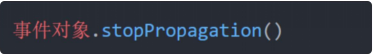

```html
<script>
  const father = document.querySelector(".father");
  const son = document.querySelector(".son");

  document.addEventListener("click", function () {
    alert("我是爷爷");
  });
  father.addEventListener("click", function () {
    alert("我是爸爸");
  });
  son.addEventListener("click", function (e) {
    alert("我是儿子");
    e.stopPropagation();
  });
</script>
```

我们某些情况下需要阻止默认行为的发生，比如 阻止 链接的跳转，表单域跳转

```html
<!DOCTYPE html>
<html lang="en">
  <head>
    <meta charset="UTF-8" />
    <meta http-equiv="X-UA-Compatible" content="IE=edge" />
    <meta name="viewport" content="width=device-width, initial-scale=1.0" />
    <title>Document</title>
  </head>

  <body>
    <form action="http://www.itcast.cn">
      <input type="submit" value="免费注册" />
    </form>
    <a href="http://www.baidu.com">百度一下</a>
    <script>
      const form = document.querySelector("form");
      form.addEventListener("submit", function (e) {
        // 阻止默认行为  提交
        e.preventDefault();
      });

      const a = document.querySelector("a");
      a.addEventListener("click", function (e) {
        e.preventDefault();
      });
    </script>
  </body>
</html>
```

### 解绑事件

1.on事件方式，直接使用null覆盖偶就可以实现事件的解绑

语法：

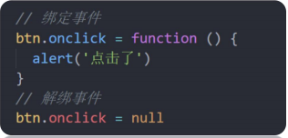

2.addEventListener方式，必须使用：removeEventListener(事件类型, 事件处理函数, [获取捕获或者冒泡阶段])

<mark>注意：匿名函数无法被解绑</mark>，故需要把函数抽取出来

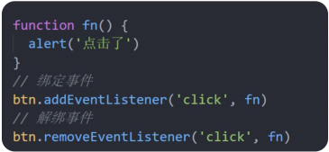

```html
<body>
  <button>点击</button>
  <script>
    const btn = document.querySelector("button");
    btn.onclick = function () {
      alert("点击了");
      btn.onclick = null;
    };

    // function fn(){
    //     alert('点击了')
    // }
    // btn.addEventListener('click', fn)
    // // btn.removeEventListener('click',fn)
  </script>
</body>
```

鼠标经过事件：

- mouseover 和 mouseout 会有冒泡效果

- mouseenter 和 mouseleave 没有冒泡效果 (推荐)

```html
<!DOCTYPE html>
<html lang="en">
  <head>
    <meta charset="UTF-8" />
    <meta http-equiv="X-UA-Compatible" content="IE=edge" />
    <meta name="viewport" content="width=device-width, initial-scale=1.0" />
    <title>Document</title>
    <style>
      .dad {
        width: 400px;
        height: 400px;
        background-color: pink;
      }

      .baby {
        width: 200px;
        height: 200px;
        background-color: purple;
      }
    </style>
  </head>
  <body>
    <div class="dad">
      <div class="baby"></div>
    </div>
    <script>
      const dad = document.querySelector(".dad");
      const baby = document.querySelector(".baby");
      dad.addEventListener("mouseenter", function () {
        console.log("鼠标经过");
      });
      dad.addEventListener("mouseleave", function () {
        console.log("鼠标离开");
      });
    </script>
  </body>
</html>
```

## 事件委托

回想一下之前我们给多个元素注册事件

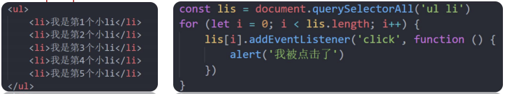

有没有一种技巧 注册一次事件就能完成以上效果呢？

事件委托是利用事件流的特征解决一些开发需求的知识技巧

- 优点：减少注册次数，可以提高程序性能

- 原理：事件委托其实是利用<mark>事件冒泡</mark>的特点。

给父元素注册事件，当我们触发子元素的时候，会冒泡到父元素身上，从而触发父元素的事件


<mark>事件对象.target. tagName</mark> 可以获得真正触发事件的元素


tab栏切换


## 其他事件

### 页面加载事件

为什么要学？

- 有些时候需要等页面资源全部处理完了做一些事情

- 老代码喜欢把 `script` 写在 `head` 中，这时候直接找`dom`元素找不到

加载外部资源（如图片、外联`CSS`和`JavaScript`等）加载完毕时触发的事件

给 `window` 添加 `load` 事件


```html
<!DOCTYPE html>
<html lang="en">
  <head>
    <meta charset="UTF-8" />
    <meta name="viewport" content="width=device-width, initial-scale=1.0" />
    <title>Document</title>
    <script>
      // 等待页面所有资源加载完毕，就回去执行回调函数
      window.addEventListener("load", function () {
        const btn = document.querySelector("button");
        btn.addEventListener("click", function () {
          alert(11);
        });
      });

      img.addEventListener("load", function () {
        // 等待图片加载完毕，再去执行里面的代码
      });

      document.addEventListener("DOMContentLoadde", function () {
        const btn = document.querySelector("button");
        btn.addEventListener("click", function () {
          alert(11);
        });
      });
    </script>
  </head>
  <body>
    <button>点击</button>
  </body>
</html>
```

### 元素滚动事件

滚动条在滚动的时候持续触发的事件，很多网页需要检测用户把页面滚动到某个区域后做一些处理， 比如固定导航栏，比如返回顶部。

语法：`scroll`


监听<mark>某个元素</mark>的内部滚动直接给某个元素加即可


#### 获取位置

我们想要页面滚动一段距离，比如`100px`，就让某些元素显示隐藏，那我们怎么知道，页面滚动了100像素呢？

`scrollLeft`和`scrollTop` 可以<mark>读取</mark>，也可以<mark>修改（赋值）</mark>


> 注意：如果是页面滚动的话，获取`html`元素是`document.documentElement`
>
> `document.documentElement.scrollTop` 得到的是一个数字型，<mark>不带单位</mark>

```html
<script>
  window.addEventListener("scroll", function () {
    // console.log('我滚了')
    console.log(document.documentElement.scrollTop);
  });
</script>
```

例子：页面滚动大小来控制盒子的隐藏

```html
<!DOCTYPE html>
<html lang="en">
  <head>
    <meta charset="UTF-8" />
    <meta http-equiv="X-UA-Compatible" content="IE=edge" />
    <meta name="viewport" content="width=device-width, initial-scale=1.0" />
    <title>Document</title>
    <style>
      body {
        padding-top: 100px;
        height: 3000px;
      }
      div {
        margin: 100px;
        overflow: scroll;
        width: 200px;
        height: 200px;
        border: 1px solid #000;
        display: none;
      }
    </style>
  </head>

  <body>
    <div>
      我里面有很多很多的文字 我里面有很多很多的文字 我里面有很多很多的文字
      我里面有很多很多的文字 我里面有很多很多的文字 我里面有很多很多的文字
      我里面有很多很多的文字 我里面有很多很多的文字 我里面有很多很多的文字
      我里面有很多很多的文字 我里面有很多很多的文字 我里面有很多很多的文字
      我里面有很多很多的文字 我里面有很多很多的文字 我里面有很多很多的文字
      我里面有很多很多的文字 我里面有很多很多的文字
    </div>
    <script>
      const div = document.querySelector("div");
      window.addEventListener("scroll", function () {
        const n = document.documentElement.scrollTop;
        if (n > 100) {
          div.style.display = "block";
        } else {
          div.style.display = "none";
        }
      });
    </script>
  </body>
</html>
```

#### 滚动到指定的坐标

`scrollTo()` 方法可把内容滚动到指定的坐标

语法：`元素.scrollTo(x, y)`


### 页面尺寸事件

会在窗口尺寸改变的时候触发事件

语法：`resize`


检测屏幕宽度：


获取元素宽高：

- 获取元素的可见部分宽高（不包含边框，`margin`，滚动条等）

- `clientWidth`和`clientHeight`


## 元素尺寸与位置

- 前面案例滚动多少距离，都是我们自己算的，最好是页面滚动到某个元素，就可以做某些事。

- 简单说，就是通过`js`的方式，得到<mark>元素在页面中的位置</mark>

- 这样我们可以做，页面滚动到这个位置，就可以做某些操作，省去计算了


获取宽高：

- 获取元素的<u>自身宽高</u>、包含元素自身设置的<u>宽高</u>、<u>padding</u>、<u>border</u>

- <u>offsetWidth</u>和<u>offsetHeight</u>

- 获取出来的是数值,方便计算

- 注意: 获取的是可视宽高, 如果盒子是隐藏的,获取的结果是0

获取位置：

- 获取元素距离自己定位父级元素的左、上距离

- <mark>`offsetLeft`和`offsetTop`注意是只读属性</mark>


## 综合案例

# Web APIs第四天

## 日期对象

日期对象：用来表示时间的对象，可以得到当前<mark>系统时间</mark>

### 实例化

在代码中发现了 new 关键字时，一般将这个操作称为<mark>实例化</mark>

创建一个时间对象并获取时间：

- 获得当前时间
  

- 获得指定时间
  

  ```html
  <body>
    <script>
      // 实例化
      // 1.得到当前时间
      const date = new Date();
      console.log(date);
      // 2.指定时间
      const date1 = new Date("2022-5-1 08:30:00");
      console.log(date1);
    </script>
  </body>
  ```

### 时间对象方法


```html
<!DOCTYPE html>
<html lang="en">
  <head>
    <meta charset="UTF-8" />
    <meta http-equiv="X-UA-Compatible" content="IE=edge" />
    <meta name="viewport" content="width=device-width, initial-scale=1.0" />
    <title>Document</title>
    <style>
      div {
        width: 300px;
        height: 40px;
        border: 1px solid pink;
        text-align: center;
        line-height: 40px;
      }
    </style>
  </head>

  <body>
    <div></div>
    <script>
      const div = document.querySelector("div");
      function getMyDate() {
        const date = new Date();
        let h = date.getHours();
        let m = date.getMinutes();
        let s = date.getSeconds();
        h = h < 10 ? "0" + h : h;
        m = m < 10 ? "0" + m : m;
        s = s < 10 ? "0" + s : s;
        return `今天是: ${date.getFullYear()}年${date.getMonth() + 1}月${date.getDate()}号 ${h}:${m}:${s}`;
      }

      div.innerHTML = getMyDate();
      setInterval(function () {
        div.innerHTML = getMyDate();
      }, 1000);
    </script>
  </body>
</html>
```

获取时间的另外一种写法

```js
div.innerHTML = date.toLocaleString(); // 2022/4/1 09:41:21
div.innerHTML = date.toLocaleDateString(); // 2022/4/1
div.innerHTML = date.toLocaleTimeString(); // 2022/4/1
```

### 时间戳

使用场景： 如果计算倒计时效果，前面方法无法直接计算，需要借助于时间戳完成

时间戳：是指1970年01月01日00时00分00秒起至现在的<mark>毫秒数</mark>，它是一种特殊的计量时间的方式

算法：

- 将来的时间戳 - 现在的时间戳 = 剩余时间毫秒数

- 剩余时间毫秒数 转换为 剩余时间的 年月日时分秒 就是 倒计时时间

- 比如 将来时间戳 2000ms - 现在时间戳 1000ms = 1000ms

- 1000ms 转换为就是 0小时0分1秒

三种方式获取时间戳

1. 使用 `getTime() `方法
   

2. 简写 `+new Date()`
   

3. 使用 `Date.now()`
   <mark>但是只能得到当前的时间戳， 而前面两种可以返回指定时间的时间戳</mark>
   

倒计时效果：

1. <mark>通过时间戳得到是毫秒，需要转换为秒在计算</mark>

2. 转换公式：
   d = parseInt(总秒数/ 60/60 /24); // 计算天数
   h = parseInt(总秒数/ 60/60 %24) // 计算小时
   m = parseInt(总秒数 /60 %60 ); // 计算分数
   s = parseInt(总秒数%60); // 计算当前秒数

## 节点操作

### DOM 节点

DOM树里每一个内容都称之为节点

节点类型：

- 元素节点
  所有的标签 比如 `body`、 `div`、`html` 是根节点

- 属性节点
  所有的属性 比如 `href`

- 文本节点
  所有的文本

- 其他


### 查找节点

#### 父节点查找

`parentNode` 属性

返回最近一级的父节点 找不到返回为`null`


```html
<!DOCTYPE html>
<html lang="en">
  <head>
    <meta charset="UTF-8" />
    <meta name="viewport" content="width=device-width, initial-scale=1.0" />
    <title>Document</title>
  </head>
  <body>
    <div class="dad">
      <div class="baby">x</div>
    </div>

    <script>
      const baby = document.querySelector(".baby");
      console.log(baby);
      console.log(baby.parentNode);
    </script>
  </body>
</html>
```

点击关闭案例：

```html
李伟兴 09:31:13
<!DOCTYPE html>
<html lang="en">
  <head>
    <meta charset="UTF-8" />
    <meta http-equiv="X-UA-Compatible" content="IE=edge" />
    <meta name="viewport" content="width=device-width, initial-scale=1.0" />
    <title>Document</title>
    <style>
      .box {
        position: relative;
        width: 1000px;
        height: 200px;
        background-color: pink;
        margin: 100px auto;
        text-align: center;
        font-size: 50px;
        line-height: 200px;
        font-weight: 700;
      }

      .box1 {
        position: absolute;
        right: 20px;
        top: 10px;
        width: 20px;
        height: 20px;
        background-color: skyblue;
        text-align: center;
        line-height: 20px;
        font-size: 16px;
        cursor: pointer;
      }
    </style>
  </head>

  <body>
    <div class="box">
      我是广告
      <div class="box1">X</div>
    </div>
    <div class="box">
      我是广告
      <div class="box1">X</div>
    </div>
    <div class="box">
      我是广告
      <div class="box1">X</div>
    </div>

    <script>
      // const box1 = document.querySelector('.box1')
      // box1.addEventListener('click',function(){
      //   this.parentNode.style.display = 'none'
      // })
      const closeBtn = document.querySelectorAll(".box1");
      for (let i = 0; i < closeBtn.length; i++) {
        closeBtn[i].addEventListener("click", function () {
          this.parentNode.style.display = "none";
        });
      }
    </script>
  </body>
</html>
```

#### 子节点查找

- childNodes
  获得所有子节点、包括文本节点（空格、换行）、注释节点等

- <mark>children 属性 （重点）</mark>
  仅获得所有元素节点
  返回的还是一个伪数组


```html
<!DOCTYPE html>
<html lang="en">
  <head>
    <meta charset="UTF-8" />
    <meta name="viewport" content="width=device-width, initial-scale=1.0" />
    <title>Document</title>
  </head>
  <body>
    <ul>
      <li>第一段</li>
      <li></li>
      <li></li>
      <li></li>
      <li></li>
    </ul>

    <script>
      const ul = document.querySelector("ul");
      console.log(ul.children);
    </script>
  </body>
</html>
```

#### 兄弟关系查找

1. 下一个兄弟节点 ：`nextElementSibling` 属性

2. 上一个兄弟节点：`previousElementSibling` 属性

```html
<!DOCTYPE html>
<html lang="en">
  <head>
    <meta charset="UTF-8" />
    <meta name="viewport" content="width=device-width, initial-scale=1.0" />
    <title>Document</title>
  </head>
  <body>
    <ul>
      <li>1</li>
      <li>2</li>
      <li>3</li>
      <li>4</li>
      <li>5</li>
    </ul>

    <script>
      const li2 = document.querySelector("ul :nth-child(2)");
      console.log(li2);
      console.log(li2.previousElementSibling);
      console.log(li2.nextElementSibling);
    </script>
  </body>
</html>
```

### 增加节点

很多情况下，我们需要在页面中增加元素，比如，点击发布按钮，可以新增一条信息

我们新增节点，按照如下操作：创建一个新的节点，再把创建的新的节点放入到指定的元素内部

#### 1.创建节点

语法：


#### 2.增加节点

插入到父元素的<mark>最后一个</mark>子元素：


插入到父元素中<mark>某个</mark>子元素的前面：


```html
<!DOCTYPE html>
<html lang="en">
  <head>
    <meta charset="UTF-8" />
    <meta http-equiv="X-UA-Compatible" content="IE=edge" />
    <meta name="viewport" content="width=device-width, initial-scale=1.0" />
    <title>Document</title>
  </head>

  <body>
    <ul>
      <li>我是老大</li>
    </ul>
    <script>
      // // 1. 创建节点
      // const div = document.createElement('div')
      // // console.log(div)
      // 2. 追加节点  作为最后一个子元素
      // document.body.appendChild(div)
      const ul = document.querySelector("ul");
      const li = document.createElement("li");
      li.innerHTML = "我是li";
      // ul.appendChild(li)
      // ul.children
      // 3. 追加节点
      // insertBefore(插入的元素, 放到哪个元素的前面)
      ul.insertBefore(li, ul.children[0]);
    </script>
  </body>
</html>
```

特殊情况下，我们需要复制节点

**克隆节点**


`cloneNode`会克隆出一个跟原标签一样的元素，括号内传入布尔值

- 若为`true`，则代表克隆时会包含后代节点一起克隆

- 若为`false`，则代表克隆时不包含后代节点，默认为`false`

```html
<!DOCTYPE html>
<html lang="en">
  <head>
    <meta charset="UTF-8" />
    <meta name="viewport" content="width=device-width, initial-scale=1.0" />
    <title>Document</title>
  </head>
  <body>
    <ul>
      <li>1</li>
      <li>2</li>
      <li>3</li>
    </ul>

    <script>
      const ul = document.querySelector("ul");
      // 1.克隆节点 元素.cloneNode(true)
      // const li1 = ul.children[0].cloneNode(true)
      // ul.appendChild(li1)
      ul.appendChild(ul.children[0].cloneNode(true));
    </script>
  </body>
</html>
```

### 删除节点

若一个节点在页面中已不需要时，可以删除它。在` JavaScript` 原生`DOM`操作中，要删除元素必须通过父元素删除

语法：


注意：

- 如不存在父子关系则删除不成功

- 删除节点和隐藏节点（`display:none`） 有区别的： 隐藏节点还是存在的，但是删除，则从`html`中删除节点

```html
<!DOCTYPE html>
<html lang="en">
  <head>
    <meta charset="UTF-8" />
    <meta name="viewport" content="width=device-width, initial-scale=1.0" />
    <title>Document</title>
  </head>
  <body>
    <ul>
      <li>没用了</li>
    </ul>
    <script>
      const ul = document.querySelector("ul");
      ul.removeChild(ul.children[0]);
    </script>
  </body>
</html>
```

## M端事件

移动端也有自己独特的地方。比如触屏事件 `touch`（也称触摸事件），`Android` 和 `IOS` 都有。

- 触屏事件 `touch`（也称触摸事件），`Android` 和 `IOS` 都有。

- `touch` 对象代表一个触摸点。触摸点可能是一根手指，也可能是一根触摸笔。触屏事件可响应用户手指（或触控笔）对屏幕或者触控板操作。

- 常见的触屏事件如下：
  

```html
<!DOCTYPE html>
<html lang="en">
  <head>
    <meta charset="UTF-8" />
    <meta name="viewport" content="width=device-width, initial-scale=1.0" />
    <title>Document</title>
    <style>
      div {
        width: 300px;
        height: 300px;
        background-color: pink;
      }
    </style>
  </head>
  <body>
    <div></div>
    <script>
      const div = document.querySelector("div");
      // 1.触摸
      div.addEventListener("touchstart", function () {
        console.log("开始摸我了");
      });

      // 2.离开
      div.addEventListener("touchend", function () {
        console.log("离开了");
      });

      // 3.移动
      div.addEventListener("touchmove", function () {
        console.log("一直摸，移动");
      });
    </script>
  </body>
</html>
```

## JS插件

- 插件: 就是别人写好的一些代码,我们只需要复制对应的代码,就可以直接实现对应的效果

- 学习插件的基本过程

- 1. 熟悉官网,了解这个插件可以完成什么需求 https://www.swiper.com.cn/
  2. 看在线演示,找到符合自己需求的demo https://www.swiper.com.cn/demo/index.html
  3. 查看基本使用流程 https://www.swiper.com.cn/usage/index.html
  4. 查看APi文档,去配置自己的插件 https://www.swiper.com.cn/api/index.html
  5. 注意: 多个swiper同时使用的时候, 类名需要注意区分

## 综合案例

学生信息表：

采用的是表单事件，一定要先阻止表单默认提交行为


```html
<!DOCTYPE html>
<html lang="en">
  <head>
    <meta charset="UTF-8" />
    <meta name="viewport" content="width=device-width, initial-scale=1.0" />
    <meta http-equiv="X-UA-Compatible" content="ie=edge" />
    <title>学生信息管理</title>
    <link rel="stylesheet" href="css/index.css" />
  </head>

  <body>
    <h1>新增学员</h1>
    <form class="info" autocomplete="off">
      姓名：<input type="text" class="uname" name="uname" /> 年龄：<input
        type="text"
        class="age"
        name="age"
      />
      性别:
      <select name="gender" class="gender">
        <option value="男">男</option>
        <option value="女">女</option>
      </select>
      薪资：<input type="text" class="salary" name="salary" /> 就业城市：<select
        name="city"
        class="city"
      >
        <option value="北京">北京</option>
        <option value="上海">上海</option>
        <option value="广州">广州</option>
        <option value="深圳">深圳</option>
        <option value="曹县">曹县</option>
      </select>
      <button class="add">录入</button>
    </form>

    <h1>就业榜</h1>
    <table>
      <thead>
        <tr>
          <th>学号</th>
          <th>姓名</th>
          <th>年龄</th>
          <th>性别</th>
          <th>薪资</th>
          <th>就业城市</th>
          <th>操作</th>
        </tr>
      </thead>
      <tbody>
        <!-- 
        <tr>
          <td>1001</td>
          <td>欧阳霸天</td>
          <td>19</td>
          <td>男</td>
          <td>15000</td>
          <td>上海</td>
          <td>
            <a href="javascript:">删除</a>
          </td>
        </tr> 
        -->
      </tbody>
    </table>
    <script>
      // 获取元素
      const uname = document.querySelector(".uname");
      const age = document.querySelector(".age");
      const gender = document.querySelector(".gender");
      const salary = document.querySelector(".salary");
      const city = document.querySelector(".city");
      const tbody = document.querySelector("tbody");
      // 获取所有带有name属性的 元素
      const items = document.querySelectorAll("[name]");
      // 声明一个空的数组， 增加和删除都是对这个数组进行操作
      const arr = [];

      // 1. 录入模块
      // 1.1 表单提交事件
      const info = document.querySelector(".info");
      info.addEventListener("submit", function (e) {
        // 阻止默认行为  不跳转
        e.preventDefault();
        // console.log(11)

        // 这里进行表单验证  如果不通过，直接中断，不需要添加数据
        // 先遍历循环
        for (let i = 0; i < items.length; i++) {
          if (items[i].value === "") {
            return alert("输入内容不能为空");
          }
        }
        // 创建新的对象
        const obj = {
          stuId: arr.length + 1,
          uname: uname.value,
          age: age.value,
          gender: gender.value,
          salary: salary.value,
          city: city.value,
        };
        // console.log(obj)
        // 追加给数组里面
        arr.push(obj);
        // console.log(arr)
        // 清空表单  重置
        this.reset();
        // 调用渲染函数
        render();
      });

      // 2. 渲染函数 因为增加和删除都需要渲染
      function render() {
        // 先清空tbody 以前的行 ，把最新数组里面的数据渲染完毕
        tbody.innerHTML = "";
        // 遍历arr数组
        for (let i = 0; i < arr.length; i++) {
          // 生成 tr
          const tr = document.createElement("tr");
          tr.innerHTML = `
          <td>${arr[i].stuId}</td>
          <td>${arr[i].uname}</td>
          <td>${arr[i].age}</td>
          <td>${arr[i].gender}</td>
          <td>${arr[i].salary}</td>
          <td>${arr[i].city}</td>
          <td>
            <a href="javascript:" data-id=${i}>删除</a>
          </td>
        `;
          // 追加元素  父元素.appendChild(子元素)
          tbody.appendChild(tr);
        }
      }

      // 3. 删除操作
      // 3.1 事件委托 tbody
      tbody.addEventListener("click", function (e) {
        if (e.target.tagName === "A") {
          // 得到当前元素的自定义属性 data-id
          // console.log(e.target.dataset.id)
          // 删除arr 数组里面对应的数据
          arr.splice(e.target.dataset.id, 1);
          console.log(arr);
          // 从新渲染一次
          render();
        }
      });
    </script>
  </body>
</html>
```

# Web APIs第五天

## Window对象

### BOM(浏览器对象模型)

`BOM(Browser Object Model )` 是浏览器对象模型



- `window`对象是一个全局对象，也可以说是`JavaScript`中的顶级对象

- 像`document、alert()、console.log()`这些都是`window`的属性，基本`BOM`的属性和方法都是`window`的。

- 所有通过`var`定义在全局作用域中的变量、函数都会变成`window`对象的属性和方法

- `window`对象下的属性和方法调用的时候可以省略`window`


### 定时器-延时函数

`JavaScript` 内置的一个用来让代码<mark>延迟执行</mark>的函数，叫 `setTimeout`

语法：


`setTimeout` <mark>仅仅只执行一次</mark>，所以可以理解为就是把一段代码延迟执行, 平时省略`window`

清除延时函数：


注意：

- 延时器需要等待,所以后面的代码先执行

- 每一次调用延时器都会产生一个新的延时器

两种定时器对比：执行的次数

- 延时函数: 执行一次

- 间歇函数:每隔一段时间就执行一次,除非手动清除

### JS执行机制

经典面试题：


`JavaScript`语言的一大特点就是<mark>单线程</mark>，也就是说，<mark>同一个时间只能做一件事</mark>。

这是因为 `Javascript` 这门脚本语言诞生的使命所致——`JavaScript` 是为处理页面中用户的交互，以及操作`DOM` 而诞生的。比如我们对某个 `DOM` 元素进行添加和删除操作，不能同时进行。 应该先进行添加，之后再删除。

单线程就意味着，所有任务需要排队，前一个任务结束，才会执行后一个任务。这样所导致的问题是：

如果` JS` 执行的时间过长，这样就会造成页面的渲染不连贯，导致页面渲染加载阻塞的感觉。

- 为了解决这个问题，利用多核 CPU 的计算能力，HTML5 提出 Web Worker 标准，允许 JavaScript 脚本创建多个线程。于是，JS 中出现了<mark>同步</mark>和<mark>异步</mark>。

**同步**

前一个任务结束后再执行后一个任务，程序的执行顺序与任务的排列顺序是一致的、同步的。比如做饭的同步做法：我们要烧水煮饭，等水开了（10分钟之后），再去切菜，炒菜。

**异步**

你在做一件事情时，因为这件事情会花费很长时间，在做这件事的同时，你还可以去处理其他事情。比如做饭的异步做法，我们在烧水的同时，利用这10分钟，去切菜，炒菜。

**同步任务**：同步任务都在主线程上执行，形成一个执行栈。


**异步任务**：JS 的异步是通过回调函数实现的。（<mark>凡是耗时的都叫异步任务</mark>）

一般而言，异步任务有以下三种类型:

1. 普通事件，如 `click、resize` 等

2. 资源加载，如 `load、error` 等

3. 定时器，包括 `setInterval、setTimeout` 等

异步任务相关添加到任务队列中（任务队列也称为消息队列）。


JS执行机制

1. 先执行<mark>执行栈中的同步任务</mark>。

2. 异步任务放入任务队列中。

3. 一旦执行栈中的所有同步任务执行完毕，系统就会按次序读取<mark>任务队列</mark>中的异步任务，于是被读取的异步任务结束等待状态，进入执行栈，开始执行。


由于主线程不断的重复获得任务、执行任务、再获取任务、再执行，所以这种机制被称为<mark>事件循环</mark>（ event loop ）。

### location对象

`location` 的数据类型是对象，它拆分并保存了 `URL` 地址的各个组成部分

常用属性和方法：

- `href `属性获取完整的 `URL` 地址，对其赋值时用于地址的跳转
  

- `search` 属性获取地址中携带的参数，符号 `？`后面部分
  
  

- `hash` 属性获取地址中的啥希值，符号 `#` 后面部分
  
  
  

- `reload` 方法用来刷新当前页面，传入参数 `true` 时表示强制刷新
  

### navigator对象

navigator是对象，该对象下记录了浏览器自身的相关信息

常用属性和方法：

- 通过 userAgent 检测浏览器的版本及平台

```javascript
// 检测 userAgent（浏览器信息）
(function () {
  const userAgent = navigator.userAgent;
  // 验证是否为Android或iPhone
  const android = userAgent.match(/(Android);?[\s\/]+([\d.]+)?/);
  const iphone = userAgent.match(/(iPhone\sOS)\s([\d_]+)/);
  // 如果是Android或iPhone，则跳转至移动站点
  if (android || iphone) {
    location.href = "http://m.itcast.cn";
  }
})();
```

### histroy对象

history 的数据类型是对象，主要管理<mark>历史记录</mark>， 该对象与浏览器地址栏的操作相对应，如前进、后退、历史记录等

**使用场景：**

history对象一般在实际开发中比较少用，但是会在一些OA 办公系统中见到。



**常见方法：**


```html
<!DOCTYPE html>
<html lang="en">
  <head>
    <meta charset="UTF-8" />
    <meta http-equiv="X-UA-Compatible" content="IE=edge" />
    <meta name="viewport" content="width=device-width, initial-scale=1.0" />
    <title>Document</title>
  </head>

  <body>
    <button>后退</button>
    <button>前进</button>
    <script>
      const back = document.querySelector("button:first-child");
      const forward = back.nextElementSibling;
      back.addEventListener("click", function () {
        // 后退一步
        // history.back()
        history.go(-1);
      });
      forward.addEventListener("click", function () {
        // 前进一步
        // history.forward()
        history.go(1);
      });
    </script>
  </body>
</html>
```

## 本地存储

### 本地存储介绍

本地存储：将数据存储在<mark>本地浏览器</mark>中

常见的使用场景：

<https://todomvc.com/examples/vanilla-es6/> 页面刷新数据不丢失

好处：

1、页面刷新或者关闭不丢失数据，实现数据持久化

2、容量较大，`sessionStorage`和` localStorage` 约 5M 左右

### 本地存储分类

#### localStorage

作用: 可以将数据永久存储在本地(用户的电脑), 除非手动删除，否则关闭页面也会存在

特性：

- 可以多窗口（页面）共享（同一浏览器可以共享）

- 以键值对的形式存储使用

语法：

**存储数据：**


**获取数据：**


**删除数据：**


```html
<!DOCTYPE html>
<html lang="en">
  <head>
    <meta charset="UTF-8" />
    <meta http-equiv="X-UA-Compatible" content="IE=edge" />
    <meta name="viewport" content="width=device-width, initial-scale=1.0" />
    <title>Document</title>
  </head>

  <body>
    <script>
      // 1. 要存储一个名字  'uname'， 'pink老师'
      // localStorage.setItem('键'，'值')
      localStorage.setItem("uname", "pink老师");
      // 2. 获取方式  都加引号
      console.log(localStorage.getItem("uname"));
      // 3. 删除本地存储  只删除名字
      // localStorage.removeItem('uname')
      // 4. 改  如果原来有这个键，则是改，如果么有这个键是增
      localStorage.setItem("uname", "red老师");

      // 我要存一个年龄
      // 2. 本地存储只能存储字符串数据类型
      localStorage.setItem("age", 18);
      console.log(localStorage.getItem("age"));
    </script>
  </body>
</html>
```

#### sessionStorage

特性：

- 生命周期为关闭浏览器窗口

- 在同一个窗口(页面)下数据可以共享

- 以键值对的形式存储使用

- 用法跟`localStorage`基本相同

- 仅在当前浏览器器窗口关闭之前有效（关闭浏览器就没了）

### 存储复杂数据类型

本地只能存储字符串,无法存储复杂数据类型.


需要将<mark>复杂数据类型转换成`JSON`字符串</mark>,在存储到本地

语法：`JSON.stringify`(复杂数据类型)


本地存储里面取出来的是字符串，不是对象，无法直接使用，需要把取出来的<mark>字符串转换为对象</mark>

语法：`JSON.parse`(`JSON`字符串)


## 综合案例

### 数组中map方法

数组中`map`方法迭代数组

使用场景：`map`可以遍历数组<mark>处理数据</mark>，并且返回<mark>新的数组</mark>

语法：


`map`也称为映射。


<mark>`map`重点在于有返回值，`forEach`没有返回值</mark>

### 数组中join方法

`join()` 方法用于把数组中的所有元素转换一个字符串

语法：


参数：数组元素是通过参数里面指定的分隔符进行分隔的

```html
<!DOCTYPE html>
<html lang="en">
  <head>
    <meta charset="UTF-8" />
    <meta name="viewport" content="width=device-width, initial-scale=1.0" />
    <meta http-equiv="X-UA-Compatible" content="ie=edge" />
    <title>学生就业统计表</title>
    <link rel="stylesheet" href="./iconfont/iconfont.css" />
    <link rel="stylesheet" href="css/index.css" />
  </head>

  <body>
    <h1>学生就业统计表</h1>
    <form class="info" autocomplete="off">
      <input type="text" class="uname" name="uname" placeholder="姓名" />
      <input type="text" class="age" name="age" placeholder="年龄" />
      <input type="text" class="salary" name="salary" placeholder="薪资" />
      <select name="gender" class="gender">
        <option value="男">男</option>
        <option value="女">女</option>
      </select>
      <select name="city" class="city">
        <option value="北京">北京</option>
        <option value="上海">上海</option>
        <option value="广州">广州</option>
        <option value="深圳">深圳</option>
        <option value="曹县">曹县</option>
      </select>
      <button class="add"><i class="iconfont icon-tianjia"></i>添加</button>
    </form>

    <div class="title">共有数据<span>0</span>条</div>
    <table>
      <thead>
        <tr>
          <th>ID</th>
          <th>姓名</th>
          <th>年龄</th>
          <th>性别</th>
          <th>薪资</th>
          <th>就业城市</th>
          <th>录入时间</th>
          <th>操作</th>
        </tr>
      </thead>
      <tbody>
        <!-- <tr>
        <td>1</td>
        <td>迪丽热巴</td>
        <td>23</td>
        <td>女</td>
        <td>12000</td>
        <td>北京</td>
        <td>2099/9/9 08:08:08</td>
        <td>
          <a href="javascript:">
            <i class="iconfont icon-shanchu"></i>
            删除
          </a>
        </td>
      </tr> -->
      </tbody>
    </table>
    <script>
      // 参考数据
      const initData = [
        {
          stuId: 1,
          uname: "迪丽热巴",
          age: 22,
          salary: "12000",
          gender: "女",
          city: "北京",
          time: "2099/9/9 08:08:08",
        },
      ];
      // localStorage.setItem('data', JSON.stringify(initData))
      // 1. 渲染业务
      // 1.1 先读取本地存储的数据
      // (1). 本地存储有数据则记得转换为对象然后存储到变量里面，后期用于渲染页面
      // (2). 如果没有数据，则用 空数组来代替
      const arr = JSON.parse(localStorage.getItem("data")) || [];
      console.log(arr);
      // 1.2 利用map和join方法来渲染页面
      const tbody = document.querySelector("tbody");
      function render() {
        // (1). 利用map遍历数组，返回对应tr的数组
        const trArr = arr.map(function (ele, index) {
          return `
          <tr>
            <td>${ele.stuId}</td>
            <td>${ele.uname}</td>
            <td>${ele.age}</td>
            <td>${ele.gender}</td>
            <td>${ele.salary}</td>
            <td>${ele.city}</td>
            <td>${ele.time}</td>
            <td>
              <a href="javascript:" data-id="${index}">
                <i class="iconfont icon-shanchu"></i>
                删除
              </a>
            </td>
          </tr>
        `;
        });

        console.log(trArr);
        // (2). 把数组转换为字符串 join
        // (3). 把生成的字符串追加给tbody
        tbody.innerHTML = trArr.join("");
        // 显示共计有几条数据
        document.querySelector(".title span").innerHTML = arr.length;
      }
      render();

      // 2. 新增业务
      const info = document.querySelector(".info");
      const uname = document.querySelector(".uname");
      const age = document.querySelector(".age");
      const salary = document.querySelector(".salary");
      const gender = document.querySelector(".gender");
      const city = document.querySelector(".city");

      // 2.1 form表单注册提交事件，阻止默认行为
      info.addEventListener("submit", function (e) {
        e.preventDefault();
        // 2.2 非空判断
        if (!uname.value || !age.value || !salary.value) {
          return alert("输入内容不能为空");
        }
        // 2.3 给 arr 数组追加对象，里面存储 表单获取过来的数据
        arr.push({
          // 处理 stuId：数组最后一条数据的stuId + 1
          stuId: arr.length ? arr[arr.length - 1].stuId + 1 : 1,
          uname: uname.value,
          age: age.value,
          salary: salary.value,
          gender: gender.value,
          city: city.value,
          time: new Date().toLocaleString(),
        });
        // 2.4 渲染页面和重置表单（reset()方法）
        render();
        this.reset(); // 重置表单

        // 2.5 把数组重新存入本地存储里面，记得转换为JSON字符串存储
        localStorage.setItem("data", JSON.stringify(arr));
      });

      // 3. 删除业务
      // 3.1 采用事件委托形式，给 tbody 注册点击事件
      tbody.addEventListener("click", function (e) {
        // 判断是否点击的是删除按钮  A 链接
        if (e.target.tagName === "A") {
          // alert(11)
          // 3.2 得到当前点击链接的索引号。渲染数据的时候，动态给a链接添加自定义属性例如 data-id="0"
          console.log(e.target.dataset.id);

          // 确认框 确认是否要真的删除
          if (confirm("您确定要删除这条数据吗？")) {
            // 3.3 根据索引号，利用 splice 删除数组这条数据
            arr.splice(e.target.dataset.id, 1);
            // 3.4 重新渲染页面
            render();
            // 3.5 把最新 arr 数组存入本地存储
            localStorage.setItem("data", JSON.stringify(arr));
          }
        }
      });
    </script>
  </body>
</html>
```

# Web APIs第六天

## 正则表达式

### 介绍

**正则表达式**（Regular Expression）是用于匹配字符串中字符组合的模式。在 JavaScript中，正则表达式也是对象。

**使用场景：**

- 例如验证表单：用户名表单只能输入英文字母、数字或者下划线， 昵称输入框中可以输入中文(<mark>匹配</mark>)，比如用户名:` /^[a-z0-9_-]{3,16}$/`

- 过滤掉页面内容中的一些敏感词(<mark>替换</mark>)，或从字符串中获取我们想要的特定部分(<mark>提取</mark>)等


### 语法

1. 定义正则表达式语法：
   
   其中 `/ /` 是正则表达式字面量
   例如：
   

2. 判断是否有符合规则的字符串：
   `test()`方法 用来查看正则表达式与指定的字符串是否匹配
   
   例如：
   
   如果正则表达式与指定的字符串匹配 ，返回`true`，否则`false`

3. 检索（查找）符合规则的字符串：
   `exec()` 方法 在一个指定字符串中执行一个搜索匹配
   
   例如：
   
   如果匹配成功，`exec()` 方法返回一个数组，否则返回`null`

### 元字符

是一些具有特殊含义的字符，可以极大提高了灵活性和强大的匹配功能。

- 比如，规定用户只能输入英文26个英文字母，普通字符的话 `abcdefghijklm…..`

- 但是换成元字符写法： `[a-z]`

MDN：https://developer.mozilla.org/zh-CN/docs/Web/JavaScript/Guide/Regular_Expressions

正则测试工具: http://tool.oschina.net/regex

为了方便记忆和学习，我们对众多的元字符进行了分类：

- 边界符（表示位置，开头和结尾，必须用什么开头，用什么结尾）

- 量词 （表示重复次数）

- 字符类 （比如 `\d` 表示 `0~9`）

#### 边界符

正则表达式中的边界符（位置符）用来提示字符所处的位置，主要有两个字符



> 如果 ^ 和 $ 在一起，表示必须是精确匹配


#### 量词

量词用来设定某个模式重复次数



> 注意： 逗号左右两侧千万不要出现空格

```html
<script>
  // 元字符

  // console.log(/哈/.test('哈')) // true
  // console.log(/哈/.test('哈哈')) // true
  // console.log(/哈/.test('二哈')) // true
  // console.log('------------------')
  // // 1. 边界符
  // console.log(/^哈/.test('哈')) // true
  // console.log(/^哈/.test('哈哈')) // true
  // console.log(/^哈/.test('二哈')) // flase
  // console.log(/^哈$/.test('哈')) // true  只有这种情况为true 否则全是false
  // console.log(/^哈$/.test('哈哈')) // false
  // console.log(/^哈$/.test('二哈')) // false

  // console.log('------------------')
  // //  量词 * 类似 >=0 次
  // console.log(/^哈$/.test('哈')) // true
  // console.log(/^哈*$/.test('')) // true
  // console.log(/^哈*$/.test('哈')) // true
  // console.log(/^哈*$/.test('哈哈')) // true
  // console.log(/^哈*$/.test('二哈很傻')) //  false
  // console.log(/^哈*$/.test('哈很傻')) //  false
  // console.log(/^哈*$/.test('哈很哈')) // false
  // console.log('------------------')
  // //  量词 + 类似 >=1 次
  // console.log(/^哈$/.test('哈')) // true
  // console.log(/^哈+$/.test('')) // false
  // console.log(/^哈+$/.test('哈')) // true
  // console.log(/^哈+$/.test('哈哈')) // true
  // console.log(/^哈+$/.test('二哈很傻')) //  false
  // console.log(/^哈+$/.test('哈很傻')) //  false
  // console.log(/^哈+$/.test('哈很哈')) // false

  // console.log('------------------')
  // console.log('------------------')
  // //  量词 ? 类似  0 || 1
  // console.log(/^哈?$/.test('')) // true
  // console.log(/^哈?$/.test('哈')) // true
  // console.log(/^哈?$/.test('哈哈')) // true
  // console.log(/^哈?$/.test('二哈很傻')) //  false
  // console.log(/^哈?$/.test('哈很傻')) //  false
  // console.log(/^哈?$/.test('哈很哈')) // false

  // 量词 {n} 写几，就必须出现几次
  console.log(/^哈{4}$/.test("哈"));
  console.log(/^哈{4}$/.test("哈哈"));
  console.log(/^哈{4}$/.test("哈哈哈"));
  console.log(/^哈{4}$/.test("哈哈哈哈"));
  console.log(/^哈{4}$/.test("哈哈哈哈哈"));
  console.log(/^哈{4}$/.test("哈哈哈哈哈哈"));
  console.log("------------------");
  // 量词 {n,}   >=n
  console.log(/^哈{4,}$/.test("哈"));
  console.log(/^哈{4,}$/.test("哈哈"));
  console.log(/^哈{4,}$/.test("哈哈哈"));
  console.log(/^哈{4,}$/.test("哈哈哈哈"));
  console.log(/^哈{4,}$/.test("哈哈哈哈哈"));
  console.log(/^哈{4,}$/.test("哈哈哈哈哈哈"));
  console.log("------------------");
  // 量词 {n,m}  逗号左右两侧千万不能有空格    >=n && <= m
  console.log(/^哈{4,6}$/.test("哈"));
  console.log(/^哈{4,6}$/.test("哈哈"));
  console.log(/^哈{4,6}$/.test("哈哈哈"));
  console.log(/^哈{4,6}$/.test("哈哈哈哈"));
  console.log(/^哈{4,6}$/.test("哈哈哈哈哈"));
  console.log(/^哈{4,6}$/.test("哈哈哈哈哈哈"));
  console.log(/^哈{4,6}$/.test("哈哈哈哈哈哈哈"));
  console.log("------------------");
</script>
```

#### 字符类

表示字符的范围，定义的规则限定在某个范围，比如只能是英文字母，或者数字等等，用表示范围。


```javascript
// 字符类   [abc]  只选1个
console.log(/^[abc]$/.test("a")); // true
console.log(/^[abc]$/.test("b")); // true
console.log(/^[abc]$/.test("c")); // true
console.log(/^[abc]$/.test("ab")); // false
console.log(/^[abc]{2}$/.test("ab")); // true
console.log("------------------");
// 字符类   [a-z]  只选1个
console.log(/^[A-Z]$/.test("p")); // false
console.log(/^[A-Z]$/.test("P")); // true
console.log(/^[0-9]$/.test(2)); // true
console.log(/^[a-zA-Z0-9]$/.test(2)); // true
console.log(/^[a-zA-Z0-9]$/.test("p")); // true
console.log(/^[a-zA-Z0-9]$/.test("P")); // true
console.log("------------------");
```

某些常见模式的简写方式，区分字母和数字


### 修饰符

修饰符约束正则执行的某些细节行为，如是否区分大小写、是否支持多行匹配等

语法：


- `i` 是单词 `ignore` 的缩写，正则匹配时字母不区分大小写

- `g` 是单词 `global` 的缩写，匹配<mark>所有</mark>满足正则表达式的结果


替换`replace`替换

语法：


```javascript
<script>
  console.log(/^java$/.test('java')) console.log(/^java$/i.test('JAVA'))
  console.log(/^java$/i.test('Java')) const str = 'java是一门编程语言，
  学完JAVA工资很高' // const re = str.replace(/java|JAVA/g, '前端') const re =
  str.replace(/java/ig, '前端') console.log(re) // 前端是一门编程语言，
  学完前端工资很高
</script>
```

## 综合案例

### change事件

给`input`注册 `change` 事件，值被修改并且失去焦点后触发

```html
<body>
  <!-- <input type="text"> -->
  <input type="checkbox" name="" id="" />
  <script>
    // change 事件 内容发生了变化
    const input = document.querySelector("input");
    input.addEventListener("change", function () {
      console.log(111);
    });
  </script>
</body>
```

```javascript
<script>
    // 1.发送验证码模块
    const code1 = document.querySelector('.xtx-form-item .code')
    let flag = true
    code1.addEventListener('click', function(){
      if(flag){
        flag = false
        let i = 6
        let timerId = setInterval(function(){
        i --
        code1.innerHTML = `0${i}秒后重新获取`
        if(i === 0){
          clearInterval(timerId)
          flag = true
          code1.innerHTML = '获取验证码'
        }
      },1000)
      }
    })

    // 2.用户名验证模块
    const username = document.querySelector('[name=username]')
    username.addEventListener('change', verifyName)
    function verifyName() {
      const span = username.nextElementSibling
      const flag = /^[a-zA-Z0-9-_]{6,10}$/.test(username.value)
      if(!flag){
        span.innerHTML = '请输入6~10的字符'
        span.style.color = 'red'
      }else{
        span.innerHTML = ''
        span.style.color = ''
      }
      return flag
    }

    // 3.手机号验证
    const phone = document.querySelector('[name=phone]')
    phone.addEventListener('change', verifyPhone)
    function verifyPhone() {
      const span = phone.nextElementSibling
      const flag = /^1(3\d|4[5-9]|5[0-35-9]|6[567]|7[0-8]|8\d|9[0-35-9])\d{8}$/.test(phone.value)
      if(!flag){
        span.innerHTML = '输入不合法，请输入正确的11位手机号'
        span.style.color = 'red'
      }else{
        span.innerHTML = ''
        span.style.color = ''
      }
      return flag
    }

    // 4.验证码验证
    const code = document.querySelector('[name=code]')
    code.addEventListener('change', verifyCode)
    function verifyCode() {
      const span = code.nextElementSibling
      const flag = /^\d{6}$/.test(code.value)
      if(!flag){
        span.innerHTML = '输入不合法，请输入6位数字'
        span.style.color = 'red'
      }else{
        span.innerHTML = ''
        span.style.color = ''
      }
      return flag
    }

    // 5.密码验证
    const password = document.querySelector('[name=password]')
    password.addEventListener('change', verifyPassword)
    function verifyPassword() {
      const span = password.nextElementSibling
      const flag = /^[a-zA-Z0-9-_]{6,20}$/.test(password.value)
      if(!flag){
        span.innerHTML = '输入不合法，请输入6~20位数字字母符号组成'
        span.style.color = 'red'
      }else{
        span.innerHTML = ''
        span.style.color = ''
      }
      return flag
    }

    // 6.再次密码验证
    const confirm = document.querySelector('[name=confirm]')
    confirm.addEventListener('change', verifyConfirm)
    function verifyConfirm() {
      const span = confirm.nextElementSibling
      if(confirm.value !== password.value){
        span.innerHTML = '两次密码输入不一致'
        span.style.color = 'red'
      }else{
        span.innerHTML = ''
        span.style.color = ''
      }
      return flag
    }

    // 7.我同意
    const queren = document.querySelector('.icon-queren')
    queren.addEventListener('click', function(){
      this.classList.toggle('icon-queren2')
    })

    // 8.提交模块
    const form = document.querySelector('form')
    form.addEventListener('submit', function(e){
      if(!queren.classList.contains('icon-queren2')){
        alert('请勾选同意协议')
        e.preventDefault();
      }
      // console.log(verifyName())
      if(!verifyName()) e.preventDefault()
      if(!verifyPhone()) e.preventDefault()
      if(!verifyCode()) e.preventDefault()
      if(!verifyPassword()) e.preventDefault()
      if(!verifyConfirm()) e.preventDefault()
    })

  </script>
```

## 阶段案例

### tab栏切换


### 提交模块

```javascript
   <script>
    // 1.tab栏切换
    const tab_nav = document.querySelector('.tab-nav')
    const pane = document.querySelectorAll('.tab-pane')
    tab_nav.addEventListener('click', function(e){
      if(e.target.tagName === 'A'){
        tab_nav.querySelector('.active').classList.remove('active')
        e.target.classList.add('active')

        for(let i = 0; i < pane.length; i++){
          pane[i].style.display = 'none'
        }
        pane[e.target.dataset.id].style.display = 'block'
      }
    })
    // 2.点击提交模块
    const form = document.querySelector('form')
    const agree = document.querySelector('[name=agree]')
    const username = document.querySelector('[name=username]')
    form.addEventListener('submit', function(e){
      e.preventDefault()
      if(!agree.checked){
        return alert('请勾选同意协议')
      }
      localStorage.setItem('xtx-uname', username.value)
      location.href = './index.html'
    })
  </script>
```

# Web APIs第七天

# JavaScript高级第一天

## 作用域

规定了变量能够被访问的“范围”，离开了这个“范围”变量便不能被访问。

### 局部作用域

1. 函数作用域：
   在函数内部声明的变量只能在函数内部被访问，外部无法直接访问。
   
   总结：
   1. 函数内部声明的变量，在函数外部无法被访问
   2. 函数的参数也是函数内部的局部变量
   3. 不同函数内部声明的变量无法互相访问
   4. 函数执行完毕后，函数内部的变量实际被清空了

2. 块作用域：
   在` JavaScript` 中使用 `{ }` 包裹的代码称为代码块，代码块内部声明的变量外部将【有可能】无法被访问。
   
   总结：
   1. let 声明的变量会产生块作用域，<mark>var 不会产生块作用域</mark>
   2. const 声明的常量也会产生块作用域
   3. 不同代码块之间的变量无法互相访问
   4. 推荐使用 `let` 或 `const`

### 全局作用域

`<script>`标签和`.js`文件的【最外层】就是所谓的全局作用域，在此声明的变量在函数内部也可以被访问。全局作用域中声明的变量，任何其它作用域都可以被访问。


注意：

1. 为 window 对象动态添加的属性默认也是全局的，不推荐！

2. 函数中未使用任何关键字声明的变量为全局变量，不推荐！！！

3. 尽可能少的声明全局变量，防止全局变量被污染

### 作用域链

作用域链本质上是底层的<mark>变量查找机制</mark>。

- 在函数被执行时，会<mark>优先查找当前</mark>函数作用域中查找变量

- 如果当前作用域查找不到则会依次<mark>逐级查找父级作用域</mark>直到全局作用域


总结：

1. 嵌套关系的作用域串联起来形成了作用域链

2. 相同作用域链中按着从小到大的规则查找变量

3. 子作用域能够访问父作用域，父级作用域无法访问子级作用域

### JS垃圾回收机制

垃圾回收机制(Garbage Collection) 简称 GC

内存的生命周期

JS环境中分配的内存, 一般有如下生命周期：

1. <mark>内存分配</mark>：当我们声明变量、函数、对象的时候，系统会自动为他们分配内存

2. <mark>内存使用</mark>：即读写内存，也就是使用变量、函数等

3. <mark>内存回收</mark>：使用完毕，由垃圾回收自动回收不再使用的内存

4. 说明：
   全局变量一般不会回收(关闭页面回收)；
   一般情况下局部变量的值, 不用了, 会被自动回收掉

<u>拓展-JS垃圾回收机制-算法说明 </u>

堆栈空间分配区别：

1. 栈（操作系统）: 由<mark>操作系统自动分配释放</mark>函数的参数值、局部变量等，基本数据类型放到栈里面。

2. 堆（操作系统）: 一般由程序员分配释放，若程序员不释放，由<mark>垃圾回收机制</mark>回收。<mark>复杂数据类型</mark>放到堆里面。

下面介绍两种常见的浏览器垃圾回收算法: 引用计数法 和 标记清除法

- 引用计数
  IE采用的引用计数算法, 定义“内存不再使用”，就是看一个对象<u>是否有指向它</u>的引用，没有引用了就回收对象
  算法：
  1. 跟踪记录被引用的次数
  2. 如果被引用了一次，那么就记录次数1,多次引用会累加 ++
  3. 如果减少一个引用就减1 --
  4. 如果引用次数是0 ，则释放内存
     
     但它却存在一个致命的问题：<mark>嵌套引用</mark>（循环引用）
     如果两个对象<mark>相互引用</mark>，尽管他们已不再使用，垃圾回收器不会进行回收，导致内存泄露。
     
     因为他们的引用次数永远不会是0。这样的相互引用如果说很大量的存在就会导致大量的内存泄露

- 标记清除法
  1. 标记清除算法将“不再使用的对象”定义为“<mark>无法达到的对象</mark>”。
  2. 就是从<mark>根部</mark>（在`JS`中就是全局对象）出发定时扫描内存中的对象。 凡是能从<mark>根部到达</mark>的对象，都是还<mark>需要使用</mark>的。
  3. 那些无法由根部出发触及到的<mark>对象被标记</mark>为不再使用，稍后进行<mark>回收</mark>。
     

### 闭包

概念：一个函数对周围状态的引用捆绑在一起，内层函数中访问到其外层函数的作用域

简单理解：**闭包 =  内层函数 + 外层函数的变量**

先看个简单的代码：


闭包作用：封闭数据，提供操作，<mark>外部也可以访问函数内部的变量</mark>


闭包应用：实现数据的私有

比如，我们要做个统计函数调用次数，函数调用一次，就++


### 变量提升

变量提升是 JavaScript 中比较“奇怪”的现象，它允许在**变量声明之前即被访问**（仅存在于<mark>var</mark>声明变量）

注意：

1. 变量在未声明即被访问时会报语法错误

2. 变量在var声明之前即被访问，变量的值为 undefined

3. let/const 声明的变量不存在变量提升

4. 变量提升出现在相同作用域当中

5. 实际开发中推荐先声明再访问变量

```html
<!DOCTYPE html>
<html lang="en">
  <head>
    <meta charset="UTF-8" />
    <meta http-equiv="X-UA-Compatible" content="IE=edge" />
    <meta name="viewport" content="width=device-width, initial-scale=1.0" />
    <title>Document</title>
  </head>

  <body>
    <script>
      // 1. 把所有var声明的变量提升到 当前作用域的最前面
      // 2. 只提升声明， 不提升赋值
      // var num
      // console.log(num + '件')
      // num = 10
      // console.log(num)

      function fn() {
        console.log(num);
        var num = 10;
      }
      fn();
    </script>
  </body>
</html>
```

## 函数进阶

### 函数提升

函数提升与变量提升比较类似，是指函数在声明之前即可被调用。


总结：

1. 函数提升能够使函数的声明调用更灵活

2. 函数表达式不存在提升的现象

3. 函数提升出现在相同作用域当中

```html
<!DOCTYPE html>
<html lang="en">
  <head>
    <meta charset="UTF-8" />
    <meta http-equiv="X-UA-Compatible" content="IE=edge" />
    <meta name="viewport" content="width=device-width, initial-scale=1.0" />
    <title>Document</title>
  </head>

  <body>
    <script>
      var fun;
      // 1. 会把所有函数声明提升到当前作用域的最前面
      // 2. 只提升函数声明，不提升函数调用
      // fn()
      // function fn() {
      //   console.log('函数提升')
      // }
      // fun()
      // var fun = function () {
      //   console.log('函数表达式')
      // }
      // 函数表达式 必须先声明和赋值， 后调用 否则 报错
    </script>
  </body>
</html>
```

### 函数参数

#### 动态参数

`arguments` 是函数内部内置的<mark>伪数组</mark>变量，它包含了调用函数时传入的所有实参


总结：

1. arguments 是一个伪数组，只存在于函数中

2. arguments 的作用是动态获取函数的实参

3. 可以通过for循环依次得到传递过来的实参

```html
<!DOCTYPE html>
<html lang="en">
  <head>
    <meta charset="UTF-8" />
    <meta http-equiv="X-UA-Compatible" content="IE=edge" />
    <meta name="viewport" content="width=device-width, initial-scale=1.0" />
    <title>Document</title>
  </head>

  <body>
    <script>
      function getSum() {
        // arguments 动态参数 只存在于 函数里面
        // 是伪数组 里面存储的是传递过来的实参
        // console.log(arguments)  [2,3,4]
        let sum = 0;
        for (let i = 0; i < arguments.length; i++) {
          sum += arguments[i];
        }
        console.log(sum);
      }
      getSum(2, 3, 4);
      getSum(1, 2, 3, 4, 2, 2, 3, 4);
    </script>
  </body>
</html>
```

#### 剩余参数

剩余参数允许我们将一个不定数量的参数表示为一个数组

1. `...` 是语法符号，置于最末函数形参之前，用于获取多余的实参

2. 借助 `...` 获取的剩余实参，是个<mark>真数组</mark>


#### 展开运算符

展开运算符(…),将一个数组进行展开，不会修改原数组


**典型运用场景： 求数组最大值(最小值)、合并数组等**


### 箭头函数

> 目的：引入箭头函数的目的是更简短的函数写法并且不绑定`this`，箭头函数的语法比函数表达式更简洁
>
> 使用场景：箭头函数更适用于那些本来需要<mark>匿名函数的地方</mark>


箭头函数参数

1. 普通函数有`arguments` 动态参数

2. 箭头函数没有 `arguments` 动态参数，但是有 剩余参数 `..args`


箭头函数 `this`

箭头函数不会创建自己的`this`,它只会从自己的<mark>作用域链的上一层</mark>沿用`this`。


DOM事件回调函数为了简便，还是不太推荐使用箭头函数


## 解构赋值

### 数组解构

数组解构是将数组的单元值<mark>快速批量赋值给一系列变量</mark>的简洁语法。

基本语法：

- 赋值运算符 = 左侧的`[]`用于批量声明变量，右侧数组的单元值将被赋值给左侧的变量

- 变量的顺序对应数组单元值的位置依次进行赋值操作


典型应用：交互2个变量


必须加分号的两种情况


1. 变量多 单元值少的情况：
   

2. 变量少 单元值多的情况：
   

3. 利用剩余参数解决变量少 单元值多的情况：
   

4. 防止有undefined传递单元值的情况，可以设置默认值：
   

5. 按需导入，忽略某些返回值：
   

6. 支持多维数组的结构：
   

### 对象解构

对象解构是将对象属性和方法快速批量赋值给一系列变量的简洁语法

基本语法：

- 赋值运算符 = 左侧的 {} 用于批量声明变量，右侧对象的属性值将被赋值给左侧的变量

- 对象属性的值将被赋值给与<mark>属性名相同</mark>的变量

- 注意解构的变量名不要和外面的变量名冲突否则报错

- 对象中找不到与变量名一致的属性时变量值为 undefined


1.可以从一个对象中提取变量并同时修改新的变量名


2.解构数组对象


3.多级对象解构：外层是对象就包对象，外层是数组就包数组


```html
<!DOCTYPE html>
<html lang="en">
  <head>
    <meta charset="UTF-8" />
    <meta http-equiv="X-UA-Compatible" content="IE=edge" />
    <meta name="viewport" content="width=device-width, initial-scale=1.0" />
    <title>Document</title>
  </head>

  <body>
    <script>
      // 1. 这是后台传递过来的数据
      const msg = {
        code: 200,
        msg: "获取新闻列表成功",
        data: [
          {
            id: 1,
            title: "5G商用自己，三大运用商收入下降",
            count: 58,
          },
          {
            id: 2,
            title: "国际媒体头条速览",
            count: 56,
          },
          {
            id: 3,
            title: "乌克兰和俄罗斯持续冲突",
            count: 1669,
          },
        ],
      };

      // 需求1： 请将以上msg对象  采用对象解构的方式 只选出  data 方面后面使用渲染页面
      // const { data } = msg
      // console.log(data)
      // 需求2： 上面msg是后台传递过来的数据，我们需要把data选出当做参数传递给 函数
      // const { data } = msg
      // msg 虽然很多属性，但是我们利用解构只要 data值
      function render({ data }) {
        // const { data } = arr
        // 我们只要 data 数据
        // 内部处理
        console.log(data);
      }
      render(msg);

      // 需求3， 为了防止msg里面的data名字混淆，要求渲染函数里面的数据名改为 myData
      function render({ data: myData }) {
        // 要求将 获取过来的 data数据 更名为 myData
        // 内部处理
        console.log(myData);
      }
      render(msg);
    </script>
  </body>
</html>
```

## 综合案例

### 遍历数组 forEach 方法（重点）

`forEach()` 方法用于调用数组的每个元素，并将元素传递给回调函数,而map会返回一个数组

主要使用场景： **遍历数组的每个元素**


```javascript
<script>
    const goodsList = [
      {
        id: '4001172',
        name: '称心如意手摇咖啡磨豆机咖啡豆研磨机',
        price: '289.00',
        picture: 'https://yanxuan-item.nosdn.127.net/84a59ff9c58a77032564e61f716846d6.jpg',
      },
      {
        id: '4001594',
        name: '日式黑陶功夫茶组双侧把茶具礼盒装',
        price: '288.00',
        picture: 'https://yanxuan-item.nosdn.127.net/3346b7b92f9563c7a7e24c7ead883f18.jpg',
      },
      {
        id: '4001009',
        name: '竹制干泡茶盘正方形沥水茶台品茶盘',
        price: '109.00',
        picture: 'https://yanxuan-item.nosdn.127.net/2d942d6bc94f1e230763e1a5a3b379e1.png',
      },
      {
        id: '4001874',
        name: '古法温酒汝瓷酒具套装白酒杯莲花温酒器',
        price: '488.00',
        picture: 'https://yanxuan-item.nosdn.127.net/44e51622800e4fceb6bee8e616da85fd.png',
      },
      {
        id: '4001649',
        name: '大师监制龙泉青瓷茶叶罐',
        price: '139.00',
        picture: 'https://yanxuan-item.nosdn.127.net/4356c9fc150753775fe56b465314f1eb.png',
      },
      {
        id: '3997185',
        name: '与众不同的口感汝瓷白酒杯套组1壶4杯',
        price: '108.00',
        picture: 'https://yanxuan-item.nosdn.127.net/8e21c794dfd3a4e8573273ddae50bce2.jpg',
      },
      {
        id: '3997403',
        name: '手工吹制更厚实白酒杯壶套装6壶6杯',
        price: '99.00',
        picture: 'https://yanxuan-item.nosdn.127.net/af2371a65f60bce152a61fc22745ff3f.jpg',
      },
      {
        id: '3998274',
        name: '德国百年工艺高端水晶玻璃红酒杯2支装',
        price: '139.00',
        picture: 'https://yanxuan-item.nosdn.127.net/8896b897b3ec6639bbd1134d66b9715c.jpg',
      },
    ]

    let str = ''
    goodsList.forEach(item => {
      str += `
      <div class="item">
      
      <p class="name">${item.name}</p>
      <p class="price">${item.price}</p>
    </div>
      `
    })
    document.querySelector('.list').innerHTML = str
  </script>
```


### 筛选数组 filter 方法（重点）

`filter()` 方法创建一个新的数组，新数组中的元素是通过检查指定数组中符合条件的所有元素

主要使用场景： 筛选数组符合条件的元素，并返回筛选之后元素的新数组.因为返回新数组，所以不会影响原数组


# JavaScript高级第二天

## 深入对象

### 创建对象三种方式

1. 利用对象字面量创建对象
   

2. 利用 `new Object` 创建对象
   

3. 利用构造函数创建对象

### 构造函数

是一种特殊的函数，主要用来初始化对象

**使用场景**：常规的 `{...}` 语法允许创建一个对象。比如我们创建了佩奇的对象，继续创建乔治的对象还需要重新写一遍，此时可以通过构造函数来快速创建多个类似的对象。


构造函数在技术上是常规函数。

不过有两个约定：

1. 它们的命名以大写字母开头。

2. 它们只能由 `"new"` 操作符来执行。

步骤：

1. 创建新对象

2. 构造函数this指向新对象

3. 执行构造函数代码，修改this，添加新的属性

4. 返回新对象

### 实例成员&静态成员

**实例成员：**

通过构造函数创建的对象称为实例对象，实例对象中的属性和方法称为实例成员。


说明：

1. <mark>实例对象的属性和方法即为实例成员</mark>

2. 为构造函数传入参数，动态创建结构相同但值不同的对象

3. 构造函数创建的实例对象彼此独立互不影响。

**静态成员：**

构造函数的属性和方法被称为静态成员


说明：

1. 构造函数的属性和方法被称为静态成员

2. 一般公共特征的属性或方法静态成员设置为静态成员

3. 静态成员方法中的 `this` 指向构造函数本身

## 内置构造函数

在 JavaScript 中<mark>最主要</mark>的数据类型有 6 种：

**基本数据类型**：字符串、数值、布尔、`undefined`、`null`

**引用类型**：对象


其实字符串、数值、布尔、等基本类型也都有专门的构造函数，这些我们称为包装类型。

JS中几乎所有的数据都可以基于构成函数创建。

### Object

学习三个常用静态方法（静态方法就是只有构造函数Object可以调用的）

`Object.keys` 静态方法获取对象中所有属性（键）

`Object.values` 静态方法获取对象中所有属性值

`Object. assign` 静态方法常用于对象拷贝


### Array

`reduce` 返回函数累计处理的结果，经常用于求和等。起始值可以省略，如果写就作为第一次累计的起始值


`find` 查找元素，返回符合测试条件的第一个数组元素值，如果没有，则返回`undefined`


`every` 检测数组中所有元素是否都符合指定条件，如果所有元素都通过检测就返回`true`


`Array.from()` 伪数组转换为真数组


总结：

1. 推荐使用字面量方式声明数组，而不是 `Array` 构造函数

2. 实例方法 `forEach` 用于遍历数组，替代 `for` 循环 (重点)

3. 实例方法 `filter` 过滤数组单元值，生成新数组(重点)

4. 实例方法 `map` 迭代原数组，生成新数组(重点)

5. 实例方法 `join` 数组元素拼接为字符串，返回字符串(重点)

6. 实例方法 `find` 查找元素， 返回符合测试条件的第一个数组元素值，如果没有符合条件的则返回 undefined(重点)

7. 实例方法`every` 检测数组所有元素是否都符合指定条件，如果**所有元素**都通过检测返回 true，否则返回 false(重点)

8. 实例方法`some` 检测数组中的元素是否满足指定条件 **如果数组中有**元素满足条件返回 true，否则返回 false

9. 实例方法 `concat` 合并两个数组，返回生成新数组

10. 实例方法 `sort` 对原数组单元值排序

11. 实例方法 `splice` 删除或替换原数组单元

12. 实例方法 `reverse` 反转数组

13. 实例方法 `findIndex` 查找元素的索引值

### String

#### split


#### substring


#### starsWith


#### includes


#### 总结：

1. 实例属性 `length` 用来获取字符串的度长(重点)
2. 实例方法 `split('分隔符')` 用来将字符串拆分成数组(重点)
3. 实例方法 `substring（需要截取的第一个字符的索引[,结束的索引号]）` 用于字符串截取(重点)
4. 实例方法 `startsWith(检测字符串[, 检测位置索引号])` 检测是否以某字符开头(重点)
5. 实例方法 `includes(搜索的字符串[, 检测位置索引号])` 判断一个字符串是否包含在另一个字符串中，根据情况返回 true 或 false(重点)
6. 实例方法 `toUpperCase` 用于将字母转换成大写
7. 实例方法 `toLowerCase` 用于将就转换成小写
8. 实例方法 `indexOf` 检测是否包含某字符
9. 实例方法 `endsWith` 检测是否以某字符结尾
10. 实例方法 `replace` 用于替换字符串，支持正则匹配
11. 实例方法 `match` 用于查找字符串，支持正则匹配

注：String 也可以当做普通函数使用，这时它的作用是强制转换成字符串数据类型。

小案例：


### Number

`toFixed()` 设置保留小数位的长度


## 综合案例

购物车案例

```html
<!DOCTYPE html>
<html lang="en">
  <head>
    <meta charset="UTF-8" />
    <meta http-equiv="X-UA-Compatible" content="IE=edge" />
    <meta name="viewport" content="width=device-width, initial-scale=1.0" />
    <title>Document</title>
    <style>
      * {
        margin: 0;
        padding: 0;
        box-sizing: border-box;
      }

      .list {
        width: 990px;
        margin: 100px auto 0;
      }

      .item {
        padding: 15px;
        transition: all 0.5s;
        display: flex;
        border-top: 1px solid #e4e4e4;
      }

      .item:nth-child(4n) {
        margin-left: 0;
      }

      .item:hover {
        cursor: pointer;
        background-color: #f5f5f5;
      }

      .item img {
        width: 80px;
        height: 80px;
        margin-right: 10px;
      }

      .item .name {
        font-size: 18px;
        margin-right: 10px;
        color: #333;
        flex: 2;
      }

      .item .name .tag {
        display: block;
        padding: 2px;
        font-size: 12px;
        color: #999;
      }

      .item .price,
      .item .sub-total {
        font-size: 18px;
        color: firebrick;
        flex: 1;
      }

      .item .price::before,
      .item .sub-total::before,
      .amount::before {
        content: "¥";
        font-size: 12px;
      }

      .item .spec {
        flex: 2;
        color: #888;
        font-size: 14px;
      }

      .item .count {
        flex: 1;
        color: #aaa;
      }

      .total {
        width: 990px;
        margin: 0 auto;
        display: flex;
        justify-content: flex-end;
        border-top: 1px solid #e4e4e4;
        padding: 20px;
      }

      .total .amount {
        font-size: 18px;
        color: firebrick;
        font-weight: bold;
        margin-right: 50px;
      }
    </style>
  </head>

  <body>
    <div class="list">
      <!-- <div class="item">
      
      <p class="name">称心如意手摇咖啡磨豆机咖啡豆研磨机 <span class="tag">【赠品】10优惠券</span></p>
      <p class="spec">白色/10寸</p>
      <p class="price">289.90</p>
      <p class="count">x2</p>
      <p class="sub-total">579.80</p>
    </div> -->
    </div>
    <div class="total">
      <div>合计：<span class="amount">1000.00</span></div>
    </div>
    <script>
      const goodsList = [
        {
          id: "4001172",
          name: "称心如意手摇咖啡磨豆机咖啡豆研磨机",
          price: 289.9,
          picture:
            "https://yanxuan-item.nosdn.127.net/84a59ff9c58a77032564e61f716846d6.jpg",
          count: 2,
          spec: { color: "白色" },
        },
        {
          id: "4001009",
          name: "竹制干泡茶盘正方形沥水茶台品茶盘",
          price: 109.8,
          picture:
            "https://yanxuan-item.nosdn.127.net/2d942d6bc94f1e230763e1a5a3b379e1.png",
          count: 3,
          spec: { size: "40cm*40cm", color: "黑色" },
        },
        {
          id: "4001874",
          name: "古法温酒汝瓷酒具套装白酒杯莲花温酒器",
          price: 488,
          picture:
            "https://yanxuan-item.nosdn.127.net/44e51622800e4fceb6bee8e616da85fd.png",
          count: 1,
          spec: { color: "青色", sum: "一大四小" },
        },
        {
          id: "4001649",
          name: "大师监制龙泉青瓷茶叶罐",
          price: 139,
          picture:
            "https://yanxuan-item.nosdn.127.net/4356c9fc150753775fe56b465314f1eb.png",
          count: 1,
          spec: { size: "小号", color: "紫色" },
          gift: "50g茶叶,清洗球,宝马, 奔驰",
        },
      ];

      // 1. 根据数据渲染页面
      document.querySelector(".list").innerHTML = goodsList
        .map((item) => {
          // console.log(item)  // 每一条对象
          // 对象解构  item.price item.count
          const { picture, name, count, price, spec, gift } = item;
          // 规格文字模块处理
          const text = Object.values(spec).join("/");
          // 计算小计模块 单价 * 数量  保留两位小数
          // 注意精度问题，因为保留两位小数，所以乘以 100  最后除以100
          const subTotal = ((price * 100 * count) / 100).toFixed(2);
          // 处理赠品模块 '50g茶叶,清洗球'
          const str = gift
            ? gift
                .split(",")
                .map((item) => `<span class="tag">【赠品】${item}</span> `)
                .join("")
            : "";
          return `
        <div class="item">
          
          <p class="name">${name} ${str} </p>
          <p class="spec">${text} </p>
          <p class="price">${price.toFixed(2)}</p>
          <p class="count">x${count}</p>
          <p class="sub-total">${subTotal}</p>
        </div>
      `;
        })
        .join("");

      // 3. 合计模块
      const total = goodsList.reduce(
        (prev, item) => prev + (item.price * 100 * item.count) / 100,
        0,
      );
      // console.log(total)
      document.querySelector(".amount").innerHTML = total.toFixed(2);
    </script>
  </body>
</html>
```

# JavaScript高级第三天

## 编程思想

### 面向过程介绍

面向过程就是分析出解决问题所需要的步骤，然后用函数把这些步骤一步一步实现，使用的时候再一个一个的依次调用就可以了。

举个栗子：蛋炒饭


### 面向对象介绍

面向对象是把事务分解成为一个个对象，然后由对象之间分工与合作。


在面向对象程序开发思想中，每一个对象都是功能中心，具有明确分工。

面向对象编程具有灵活、代码可复用、容易维护和开发的优点，更适合多人合作的大型软件项目。

面向对象的特性：

- 封装性

- 继承性

- 多态性

面向过程和面向对象的对比：


## 构造函数


**浪费内存问题：**


我们希望所有的对象使用同一个函数，这样就比较节省内存，<mark>那么我们要怎样做呢？</mark>-------原型

## 原型

### 原型


#### 原型- this指向

**构造函数和原型对象中的this 都指向 <mark>实例化的对象</mark>**

```html
<!DOCTYPE html>
<html lang="en">
  <head>
    <meta charset="UTF-8" />
    <meta name="viewport" content="width=device-width, initial-scale=1.0" />
    <title>Document</title>
  </head>

  <body>
    <script>
      let that;
      function Star(uname) {
        that = this;
        this.uname = uname;
      }
      Star.prototype.sing = function () {
        console.log("唱歌");
      };
      const ldh = new Star("刘德华");
      console.log(that === ldh); // true
    </script>
  </body>
</html>
```

#### 给数组扩展方法


### constructor 属性

在哪里？ 每个原型对象里面都有个`constructor` 属性（constructor 构造函数）

作用：该属性**指向**该原型对象的<mark>构造函数， 简单理解，就是指向我的爸爸，我是有爸爸的孩子</mark>


#### 了解constructor属性的作用

如果有多个对象的方法，我们可以给原型对象采取对象形式赋值.

但是这样就会覆盖构造函数原型对象原来的内容，这样修改后的原型对象 constructor 就不再指向当前构造函数了

此时，我们可以在修改后的原型对象中，添加一个 constructor 指向原来的构造函数。


### 对象原型

构造函数可以创建实例对象，构造函数还有一个原型对象，一些公共的属性或者方法放到这个原型对象身上，但是为啥实例对象可以访问原型对象里面的属性和方法呢？


<mark>对象都会有一个属性 **proto** </mark>指向构造函数的 prototype 原型对象，之所以我们对象可以使用构造函数 prototype，原型对象的属性和方法，就是因为对象有 **proto** 原型的存在。


注意：

- **proto** 是JS非标准属性

- [[prototype]]和**proto**意义相同

- 用来表明当前实例对象指向哪个原型对象prototype

- **proto**对象原型里面也有一个 constructor属性，<mark>指向创建该实例对象的构造函数</mark>

### 原型继承

继承是面向对象编程的另一个特征，通过继承进一步提升代码封装的程度，JavaScript 中大多是借助原型对象实现继承的特性。

龙生龙、凤生凤、老鼠的儿子会打洞描述的正是继承的含义。我们来看个代码：


1. <mark>封装</mark>-**抽取公共部分**
   把男人和女人公共的部分抽取出来放到人类里面

2. <mark>继承</mark>-让男人和女人都能继承人类的一些属性和方法
    把男人女人公共的属性和方法抽取出来 People
    然后赋值给Man的原型对象，可以共享这些属性和方法
    注意让constructor指回Man这个构造函数


问题：


原因：


解决：


### 原型链

基于原型对象的继承使得不同构造函数的原型对象关联在一起，并且这种关联的关系是一种链状的结构，我们将原型对象的链状结构关系称为原型链

只要是原型对象就有constructor


**查找规则**

① 当访问一个对象的属性（包括方法）时，首先查找这个<mark>对象自身</mark>有没有该属性。

② 如果没有就查找它的原型（也就是 **proto**指向的 <mark>prototype 原型对象</mark>）

③ 如果还没有就查找原型对象的原型（<mark>Object的原型对象</mark>）

④ 依此类推一直找到 Object 为止（<mark>null</mark>）

⑤ **proto**对象原型的意义就在于为对象成员查找机制提供一个方向，或者说一条路线

**⑥** **可以使用 instanceof 运算符用于检测构造函数的 prototype 属性是否出现在某个实例对象的原型链上**

## 综合案例

### 消息提示对象封装

目的： 练习面向对象写插件（模态框）

需求：


分析需求：

1. 定义模态框 Modal 构造函数，用来创建对象

2. 模态框具备 打开功能 open 方法 （按钮点击可以打开模态框）

3. 模态框 具备关闭功能 close 方法

问：

open 和 close 方法 写到哪里？

<mark>构造函数的原型对象上，共享方法</mark>

<mark>所以可以分为三个模块， 构造函数， open方法， close方法</mark>

步骤：


```html
<!DOCTYPE html>
<html lang="en">
  <head>
    <meta charset="UTF-8" />
    <meta name="viewport" content="width=device-width, initial-scale=1.0" />
    <title>Document</title>
  </head>

  <body>
    <button id="delete">删除</button>
    <button id="login">登录</button>

    <script>
      function Modal(title = "", message = "") {
        this.modalBox = document.createElement("div");
        this.modalBox.className = "modal";
        this.modalBox.innerHTML = `
      <div class="header">${title} <i>x</i></div>
      <div class="body">${message}</div>
      `;
      }

      Modal.prototype.open = function () {
        const box = document.querySelector(".modal");
        box && box.remove();
        document.body.append(this.modalBox);
        this.modalBox.querySelector("i").addEventListener("click", () => {
          this.close();
        });
      };
      Modal.prototype.close = function () {
        this.modalBox.remove();
      };

      document.querySelector("#delete").addEventListener("click", () => {
        const del = new Modal("温馨提示", "您没有权限删除操作");
        del.open();
      });

      document.querySelector("#login").addEventListener("click", () => {
        const login = new Modal("友情提示", "您还没登录呢");
        login.open();
      });
    </script>
  </body>
</html>
```

# JavaScript高级第四天

## 深浅拷贝

开发中我们经常需要复制一个对象。如果直接用赋值会有下面问题：


### 浅拷贝


如果是简单数据类型拷贝值，引用数据类型拷贝的是地址 (简单理解： 如果是单层对象，没问题，如果有多层就有问题)

1. 直接赋值和浅拷贝有什么区别？

 直接赋值的方法，只要是对象，都会相互影响，因为是直接拷贝对象栈里面的地址

 <mark>浅拷贝如果是一层对象，不相互影响，如果出现多层对象拷贝还会相互影响</mark>

2. 浅拷贝怎么理解？

 拷贝对象之后，里面的属性值是简单数据类型**直接拷贝值**

 如果属性值是**引用数据类型则拷贝的是地址**

### 深拷贝

首先浅拷贝和深拷贝只针对引用类型

深拷贝：拷贝的是对象，不是地址

**常见方法：**

1. 通过递归实现深拷贝

2. lodash/cloneDeep

3. 通过JSON.stringify()实现

#### 通过递归实现深拷贝

**函数递归：**

<mark>如果一个函数在内部可以调用其本身，那么这个函数就是递归函数</mark>

- 简单理解:函数内部自己调用自己, 这个函数就是递归函数

- 递归函数的作用和循环效果类似

- 由于递归很容易发生“栈溢出”错误（stack overflow），所以<mark>必须要加退出条件 return</mark>


```js
<script>
  let i = 1
  function fn() {
    console.log(`这是第${i}次`)
    if (i >= 6) {
      return
    }
    i++
    fn()
  }
  fn()
</script>
```

<mark>利用递归函数实现 setTimeout 模拟 setInterval效果</mark>


**深拷贝实现原理：**


面试问：做个深拷贝吗？

深拷贝需要用到函数递归，当我们在普通拷贝的时候，没问题，直接进行赋值就行了，但是如果遇到数组了，我再次调用这个递归就可以了，如果遇到对象，我再次利用递归把对象解决，要先Array再对象。

#### js库lodash里面cloneDeep内部实现了深拷贝


#### 通过JSON.stringify()实现


## 异常处理

### throw 抛异常

异常处理是指预估代码执行过程中可能发生的错误，然后最大程度的避免错误的发生导致整个程序无法继续运行


### try /catch 捕获异常

我们可以通过try / catch 捕获错误信息（浏览器提供的错误信息） try 试试 catch 拦住 finally 最后


### debugger

我们可以通过try / catch 捕获错误信息（浏览器提供的错误信息）


## 处理this

### this指向

this 是 JavaScript 最具“魅惑”的知识点，不同的应用场合 this 的取值可能会有意想不到的结果，在此我们对以往学习过的关于【 this 默认的取值】情况进行归纳和总结。

目标： 了解函数中 this 在不同场景下的默认值，知道动态指定函数 this 值的方法

#### this指向-普通函数

目标： 能说出普通函数的this指向

普通函数的调用方式决定了 this 的值，即【谁调用 this 的值指向谁】


普通函数**没有明确调用者时 this 值为 window**，严格模式下**没有调用者时 this 的值为 undefined**

#### this指向-箭头函数

目标： 能说出箭头函数的this指向

箭头函数中的 this 与普通函数完全不同，也不受调用方式的影响，事实上<mark>箭头函数中并不存在 this </mark>！

1. 箭头函数会默认帮我们绑定外层 this 的值，所以在箭头函数中 this 的值和外层的 this 是一样的
2. 箭头函数中的this引用的就是最近作用域中的this
3. 向外层作用域中，一层一层查找this，直到有this的定义


**注意情况1：**

在开发中【使用箭头函数前需要考虑函数中 this 的值】，事件回调函数使用箭头函数时，this 为全局的 window。因此DOM事件回调函数<mark>如果里面需要</mark>DOM对象的this，则不推荐使用箭头函数。


**注意情况2：**

同样由于箭头函数 this 的原因，基于原型的面向对象也不推荐采用箭头函数


### 改变this

#### call()


#### apply()


**使用场景：**


#### bind()-重点


#### call apply bind 总结

**相同点：** 都可以改变函数内部的this指向.

**区别点:**

1. call 和 apply 会调用函数, 并且改变函数内部this指向.

2. call 和 apply 传递的参数不一样, call 传递参数 aru1, aru2..形式 apply 必须数组形式[arg]

3. <mark>bind 不会调用函数, 可以改变函数内部this指向.</mark>

**主要应用场景:**

1. call 调用函数并且可以传递参数

2. apply 经常跟数组有关系. 比如借助于数学对象实现数组最大值最小值

3. <mark>bind 不调用函数,但是还想改变this指向. 比如改变定时器内部的this指向.</mark>

## 性能优化

### 防抖


#### 利用防抖来处理-鼠标滑过盒子显示文字


**lodash实现：**

官方网站：[lodash.debounce | Lodash中文文档 | Lodash中文网](https://www.lodashjs.com/docs/lodash.debounce#_debouncefunc-wait0-options)


**手写防抖函数实现：**

核心思路：

利用定时器实现，当鼠标滑过，判断有没有定时器，还有就清除，以最后一次滑动为准开启定时器

①： 写一个防抖函数debounce ，来控制这个操作函数(mouseMove)

②： 防抖函数传递2个参数， 第一个参数 mouseMove函数，第二个参数 指定时间500ms

③： 鼠标移动事件，里面写的是防抖函数

④： 声明定时器变量 timeId

⑤： 但是节流函数因为里面写的函数名 debounce(mouseMove, 500), 是调用函数，无法再次调用执行，所以需要在节流函数里面写return 函数 这样可以多次执行

⑥： 如果有定时器，则清除定时器

⑦：否则开启定时器， 在设定时间内，调用函数

```html
<!DOCTYPE html>
<html lang="en">
  <head>
    <meta charset="UTF-8" />
    <meta http-equiv="X-UA-Compatible" content="IE=edge" />
    <meta name="viewport" content="width=device-width, initial-scale=1.0" />
    <title>Document</title>
    <style>
      .box {
        width: 500px;
        height: 500px;
        background-color: #ccc;
        color: #fff;
        text-align: center;
        font-size: 100px;
      }
    </style>
  </head>

  <body>
    <div class="box"></div>
    <!-- <script src="./lodash.min.js"></script> -->
    <script>
      const box = document.querySelector(".box");
      let i = 1;
      function mouseMove() {
        box.innerHTML = i++;
      }
      // box.addEventListener('mousemove', mouseMove)

      // 利用 lodash 库实现防抖 - 500毫秒之后采取+1
      // box.addEventListener('mousemove', _.debounce(mouseMove, 500))

      // 手写防抖函数
      // 核心是利用 setTimeout定时器来实现
      // 1. 声明定时器变量
      // 2. 每次鼠标移动(事件触发)的时候都要先判断是否有定时器,如果有先清楚以前的定时器
      // 3. 如果没有定时器, 则开启定时器, 存入到定时器变量里面
      // 4. 定时器里面写函数调用
      function debounce(fn, t) {
        let timer;
        // return 返回一个匿名函数
        return function () {
          if (timer) clearTimeout(timer);
          timer = setTimeout(function () {
            fn(); // 加小括号调用 fn 函数
          }, t);
        };
      }
      box.addEventListener("mousemove", debounce(mouseMove, 500));
    </script>
  </body>
</html>
```

### 节流


#### 利用节流来处理-鼠标滑过盒子显示文字


**lodash实现：**

官方网站：[lodash.throttle | Lodash中文文档 | Lodash中文网](https://www.lodashjs.com/docs/lodash.throttle#_throttlefunc-wait0-options)


**手写防抖函数实现：**

```html
<!DOCTYPE html>
<html lang="en">
  <head>
    <meta charset="UTF-8" />
    <meta http-equiv="X-UA-Compatible" content="IE=edge" />
    <meta name="viewport" content="width=device-width, initial-scale=1.0" />
    <title>Document</title>
    <style>
      .box {
        width: 500px;
        height: 500px;
        background-color: #ccc;
        color: #fff;
        text-align: center;
        font-size: 100px;
      }
    </style>
  </head>

  <body>
    <div class="box"></div>
    <!-- <script src="./lodash.min.js"></script> -->
    <script>
      const box = document.querySelector(".box");
      let i = 1;
      function mouseMove() {
        box.innerHTML = i++;
      }
      // box.addEventListener('mousemove', mouseMove)

      // 利用 lodash 库实现防抖 - 500毫秒之后采取+1
      // box.addEventListener('mousemove', _.debounce(mouseMove, 500))

      // 手写节流函数
      // 核心是利用 setTimeout定时器来实现
      // 1. 声明定时器变量
      // 2. 每次鼠标移动(事件触发)的时候都要先判断是否有定时器,如果有先则不开启新的定时器
      // 3. 如果没有定时器,则开启定时器, 存入到定时器变量里面
      // 3.1 定时器里面调用执行的函数
      // 3.2 定时器里面要把定时器清空
      function throttle(fn, t) {
        let timer;
        // return 返回一个匿名函数
        return function () {
          if (!timer) {
            timer = setTimeout(function () {
              fn();
              // 清除定时器
              timer = null;
            }, t);
          }
        };
      }
      box.addEventListener("mousemove", debounce(mouseMove, 500));
    </script>
  </body>
</html>
```

## 综合案例
